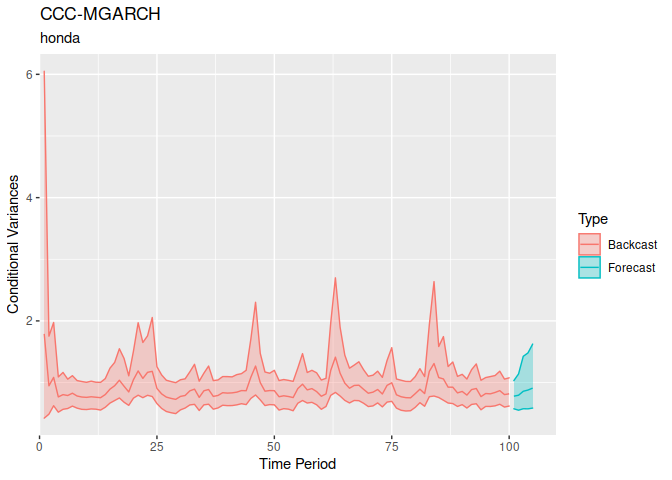

<!-- README.md is generated from README.Rmd. Please edit that file -->
<!-- knit with render("README.Rmd", output_format = "md_document") -->
bmgarch
=======

`bmgarch` estimates Bayesian multivariate generalized autoregressive
conditional heteroskedasticity (MGARCH) models. Currently, bmgarch
supports ARMA(1,1) and intercept-only (Constant) mean structures, and a
variety of MGARCH(P,Q) parameterizations. In increasing order of
complexity:

-   CCC(P, Q): Constant Conditional Correlation
-   DCC(P, Q): Dynamic Conditional Correlation
-   BEKK(P, Q): Baba, Engle, Kraft, and Kroner
-   pdBEKK(P, Q): BEKK(P, Q) with positive diagonal constraints

Installation
------------

`bmgarch` is not yet available on CRAN.

The development version can be installed from
[GitHub](https://github.com/) with:

    devtools::install_github("ph-rast/bmgarch")

Example 1: Behavioral Data
--------------------------

In this example, we use the pdBEKK(1,1) model for the variances, and an
intercept-only model for the means.

    library(bmgarch)

    data(panas)
    head(panas)
    #>      Pos    Neg
    #> 1 -2.193 -2.419
    #> 2  1.567 -0.360
    #> 3 -0.124 -1.202
    #> 4  0.020 -1.311
    #> 5 -0.150  2.004
    #> 6  3.877  1.008

    # Fit pdBEKK(1, 1) with ARMA(1,1) on the mean structure.
    fit <- bmgarch(panas,
                   parameterization = "pdBEKK",
                   iterations = 1000,
                   P = 1, Q = 1,
                   distribution = "Student_t",
                   meanstructure = "arma")
    #> 
    #> CHECKING DATA AND PREPROCESSING FOR MODEL 'pdBEKKMGARCH' NOW.
    #> 
    #> COMPILING MODEL 'pdBEKKMGARCH' NOW.
    #> 
    #> STARTING SAMPLER FOR MODEL 'pdBEKKMGARCH' NOW.

### Parameter estimates

    summary(fit)
    #> Model: pdBEKK-MGARCH
    #> Basic Specification: H_t = D_t R D_t
    #> H_t = C + A'[y_(t-1)*y'_(t-1)]A + B'H_(t-1)B
    #> 
    #> Distribution:  Student_t
    #> ---
    #> Iterations:  1000
    #> Chains:  4
    #> Date:  Sat Aug 22 11:42:42 2020
    #> Elapsed time (min):  17.22
    #> 
    #> ---
    #> Constant correlation, R (diag[C]*R*diag[C]):
    #> 
    #>         mean   sd  mdn  2.5% 97.5% n_eff Rhat
    #> R_Ng-Ps 0.15 0.48 0.27 -0.85  0.92 10.53 1.14
    #> 
    #> 
    #> Constant variances (diag[C]):
    #> 
    #>        mean   sd  mdn 2.5% 97.5% n_eff Rhat
    #> var_Ps 0.86 0.81 0.57 0.02  3.00 12.25 1.16
    #> var_Ng 1.18 0.35 1.09 0.43  1.87 60.36 1.06
    #> 
    #> 
    #> MGARCH(1,1) estimates for A:
    #> 
    #>          mean   sd   mdn  2.5% 97.5% n_eff Rhat
    #> A_Ps-Ps  0.26 0.17  0.30  0.00  0.54  2.63 2.01
    #> A_Ng-Ps  0.00 0.13  0.03 -0.20  0.20  2.54 2.12
    #> A_Ps-Ng -0.02 0.17 -0.01 -0.24  0.31  3.57 1.51
    #> A_Ng-Ng  0.33 0.16  0.35  0.09  0.62  4.23 1.40
    #> 
    #> 
    #> MGARCH(1,1) estimates for B:
    #> 
    #>          mean   sd   mdn  2.5% 97.5% n_eff Rhat
    #> B_Ps-Ps  0.56 0.37  0.77  0.01  0.94  2.71 2.04
    #> B_Ng-Ps  0.00 0.22 -0.05 -0.48  0.32  3.22 1.68
    #> B_Ps-Ng -0.07 0.66  0.16 -1.08  1.03  2.77 1.93
    #> B_Ng-Ng  0.30 0.18  0.24  0.02  0.69 23.75 1.09
    #> 
    #> 
    #> ARMA(1,1) estimates on the location:
    #> 
    #>                  mean   sd   mdn  2.5% 97.5%  n_eff Rhat
    #> (Intercept)_Pos -0.04 0.14 -0.06 -0.32  0.24  49.38 1.05
    #> (Intercept)_Neg  0.03 0.13  0.03 -0.13  0.30   4.63 1.35
    #> Phi_Pos-Pos      0.11 0.38  0.17 -0.73  0.71   7.62 1.22
    #> Phi_Pos-Neg     -0.21 0.45 -0.36 -0.87  0.78  14.51 1.11
    #> Phi_Neg-Pos     -0.23 0.37 -0.32 -0.80  0.64  12.75 1.13
    #> Phi_Neg-Neg      0.03 0.39 -0.04 -0.76  0.85 271.81 1.01
    #> Theta_Pos-Pos   -0.21 0.42 -0.27 -0.83  0.67   6.16 1.27
    #> Theta_Pos-Neg    0.18 0.50  0.27 -0.90  0.80   6.32 1.23
    #> Theta_Neg-Pos    0.27 0.38  0.34 -0.63  0.83   8.54 1.18
    #> Theta_Neg-Neg   -0.07 0.40 -0.08 -0.89  0.77 281.19 1.00
    #> 
    #> 
    #> Df constant student_t (nu):
    #> 
    #>   mean     sd    mdn   2.5%  97.5%  n_eff   Rhat 
    #>  42.49  32.78  37.23   6.57 118.29   4.77   1.32 
    #> 
    #> 
    #> Log density posterior estimate:
    #> 
    #>    mean      sd     mdn    2.5%   97.5%   n_eff    Rhat 
    #> -804.85    5.73 -804.56 -814.32 -794.54    5.41    1.32

### Forecasted values

    fit.fc <- forecast(fit, ahead = 5)

    fit.fc
    #> ---
    #> [Mean] Forecast for 5 ahead:
    #> 
    #> Pos :
    #>       
    #> period  mean   sd   mdn  2.5% 97.5%   n_eff Rhat
    #>    201 -0.94 3.02 -1.04 -6.72  5.08   87.98 1.03
    #>    202 -0.57 2.92 -0.64 -5.98  5.21  332.42 1.03
    #>    203 -0.52 2.75 -0.48 -5.91  4.66  925.91 1.01
    #>    204 -0.45 2.70 -0.49 -5.57  4.73 1137.17 1.00
    #>    205 -0.36 2.61 -0.32 -5.24  4.76 1240.17 1.01
    #> Neg :
    #>       
    #> period mean   sd  mdn  2.5% 97.5%   n_eff Rhat
    #>    201 0.68 1.71 0.63 -2.46  4.15  179.69 1.03
    #>    202 0.47 1.65 0.51 -2.81  3.83 1090.15 1.01
    #>    203 0.40 1.61 0.38 -2.84  3.58 1402.97 1.01
    #>    204 0.32 1.61 0.32 -2.80  3.49 1392.29 1.00
    #>    205 0.24 1.64 0.22 -3.04  3.63 1611.37 1.00
    #> ---
    #> [Variance] Forecast for 5 ahead:
    #> 
    #> Pos :
    #>       
    #> period mean   sd  mdn 2.5% 97.5%  n_eff Rhat
    #>    201 7.05 2.76 6.58 3.74 13.22  16.59 1.07
    #>    202 6.66 3.59 5.62 3.53 14.68  50.05 1.02
    #>    203 6.26 4.49 5.09 2.99 16.09  65.23 1.02
    #>    204 6.08 5.32 4.64 2.97 16.33 113.20 1.01
    #>    205 5.95 7.13 4.36 2.89 17.22 315.31 1.01
    #> Neg :
    #>       
    #> period mean   sd  mdn 2.5% 97.5%  n_eff Rhat
    #>    201 2.08 0.45 2.04 1.36  2.97  23.26 1.13
    #>    202 2.14 0.85 1.94 1.40  4.21 290.07 1.01
    #>    203 2.22 1.42 1.92 1.42  4.74 982.50 1.01
    #>    204 2.19 1.27 1.91 1.36  5.35 148.25 1.02
    #>    205 2.16 1.38 1.90 1.36  4.62 467.46 1.01
    #> [Correlation] Forecast for 5 ahead:
    #> 
    #> Neg_Pos :
    #>       
    #> period  mean   sd   mdn  2.5% 97.5%  n_eff Rhat
    #>    201 -0.07 0.14 -0.05 -0.39  0.21 479.15 1.00
    #>    202 -0.04 0.19 -0.02 -0.45  0.34 146.38 1.02
    #>    203 -0.02 0.21  0.01 -0.47  0.37  92.65 1.03
    #>    204  0.00 0.20  0.02 -0.43  0.42 143.66 1.02
    #>    205 -0.01 0.20  0.01 -0.45  0.35 114.81 1.03

    plot(fit.fc, askNewPage = FALSE, type = "var")

    plot(fit.fc, askNewPage = FALSE, type = "cor")

Example 2: Stocks
-----------------

Here we use the first 100 days of Stata's stocks data on daily lagged
returns of three Japanese automakers, Toyota, Nissan, and Honda.

    library(bmgarch)

    data(stocks)
    head(stocks)
    #>         date t       toyota       nissan        honda
    #> 1 2003-01-02 1  0.015167475  0.029470444  0.031610250
    #> 2 2003-01-03 2  0.004820108  0.008173466  0.002679110
    #> 3 2003-01-06 3  0.019958735  0.013064146 -0.001606464
    #> 4 2003-01-07 4 -0.013322592 -0.007444382 -0.011317968
    #> 5 2003-01-08 5 -0.027001143 -0.018856525 -0.016944885
    #> 6 2003-01-09 6  0.011634588  0.016986847  0.013687611

Ease computation by first standardizing the time series

    stocks.z <- scale(stocks[,c("toyota", "nissan", "honda")])
    head(stocks.z )
    #>       toyota     nissan       honda
    #> 1  0.8151655  1.3417896  1.52836901
    #> 2  0.2517820  0.3687089  0.11213515
    #> 3  1.0760354  0.5921691 -0.09765177
    #> 4 -0.7360344 -0.3448866 -0.57304819
    #> 5 -1.4807910 -0.8663191 -0.84849638
    #> 6  0.6228102  0.7714013  0.65102202

    # Fit CCC(1, 1) with constant on the mean structure.
    fit1 <- bmgarch(stocks.z[1:100, c("toyota", "nissan", "honda")],
                    parameterization = "CCC",
                    iterations = 100,
                    P = 1, Q = 1,
                    distribution = "Student_t",
                    meanstructure = "constant")
    #> 
    #> CHECKING DATA AND PREPROCESSING FOR MODEL 'CCCMGARCH' NOW.
    #> 
    #> COMPILING MODEL 'CCCMGARCH' NOW.
    #> 
    #> STARTING SAMPLER FOR MODEL 'CCCMGARCH' NOW.

### Parameter Estimates

    summary( fit1 )
    #> Model: CCC-MGARCH
    #> Basic Specification: H_t = D_t R D_t
    #>  diag(D_t) = sqrt(h_[ii,t]) = c_h + a_h*y^2_[t-1] + b_h*h_[ii, t-1
    #> 
    #> Distribution:  Student_t
    #> ---
    #> Iterations:  100
    #> Chains:  4
    #> Date:  Sat Aug 22 11:43:19 2020
    #> Elapsed time (min):  0.36
    #> 
    #> GARCH(1,1)  estimates for conditional variance:
    #> 
    #>            mean   sd  mdn 2.5% 97.5%  n_eff Rhat
    #> a_h_1,ty   0.11 0.10 0.07 0.00  0.31 167.76 1.00
    #> a_h_1,ns   0.09 0.09 0.07 0.01  0.27 232.26 0.99
    #> a_h_1,hn   0.11 0.09 0.09 0.01  0.34 252.01 0.99
    #> b_h_1,ty   0.45 0.20 0.47 0.07  0.82 364.92 0.99
    #> b_h_1,ns   0.37 0.20 0.35 0.05  0.79 242.15 0.99
    #> b_h_1,hn   0.40 0.20 0.38 0.05  0.77 399.75 0.99
    #> c_h_var_ty 0.29 0.14 0.28 0.08  0.62 369.94 0.99
    #> c_h_var_ns 0.36 0.14 0.35 0.10  0.62 216.62 0.99
    #> c_h_var_hn 0.44 0.19 0.44 0.13  0.83 406.96 1.00
    #> 
    #> 
    #> Constant correlation (R) coefficients:
    #> 
    #>         mean   sd  mdn 2.5% 97.5%  n_eff Rhat
    #> R_ns-ty 0.65 0.07 0.65 0.48  0.78 230.85 0.99
    #> R_hn-ty 0.74 0.05 0.74 0.65  0.82 184.91 0.99
    #> R_hn-ns 0.64 0.07 0.65 0.48  0.75 184.12 0.99
    #> 
    #> 
    #> Intercept estimates on the location:
    #> 
    #>                     mean   sd   mdn  2.5% 97.5%  n_eff Rhat
    #> (Intercept)_toyota -0.09 0.08 -0.09 -0.25  0.10 168.08 0.99
    #> (Intercept)_nissan -0.01 0.08  0.00 -0.17  0.16 124.01 1.02
    #> (Intercept)_honda  -0.02 0.10 -0.02 -0.22  0.16 170.80 1.01
    #> 
    #> 
    #> Df constant student_t (nu):
    #> 
    #>   mean     sd    mdn   2.5%  97.5%  n_eff   Rhat 
    #>  33.93  26.82  25.97   7.61 101.33 256.47   1.01 
    #> 
    #> 
    #> Log density posterior estimate:
    #> 
    #>    mean      sd     mdn    2.5%   97.5%   n_eff    Rhat 
    #> -178.83    5.13 -178.70 -188.98 -169.86   92.18    1.04

### Forecasted Values

Forecast volatility 10 days ahead

    fc <- forecast(fit1, ahead = 10 )
    fc
    #> ---
    #> [Variance] Forecast for 10 ahead:
    #> 
    #> toyota :
    #>       
    #> period mean   sd  mdn 2.5% 97.5%  n_eff Rhat
    #>    101 0.54 0.12 0.54 0.35  0.79 238.98    1
    #>    102 0.59 0.14 0.57 0.36  0.93 244.61    1
    #>    103 0.61 0.18 0.58 0.37  1.02 213.55    1
    #>    104 0.63 0.22 0.60 0.36  1.07 217.06    1
    #>    105 0.64 0.20 0.61 0.36  1.18 190.26    1
    #>    106 0.66 0.26 0.61 0.36  1.27 107.85    1
    #>    107 0.65 0.26 0.62 0.37  1.04 231.08    1
    #>    108 0.67 0.29 0.62 0.38  1.32 217.88    1
    #>    109 0.66 0.25 0.60 0.39  1.24 171.65    1
    #>    110 0.67 0.26 0.62 0.38  1.25 194.10    1
    #> nissan :
    #>       
    #> period mean   sd  mdn 2.5% 97.5%  n_eff Rhat
    #>    101 0.61 0.11 0.60 0.44  0.86 184.33 1.00
    #>    102 0.64 0.16 0.61 0.43  0.98 165.51 1.00
    #>    103 0.65 0.16 0.62 0.43  1.03 220.47 0.99
    #>    104 0.66 0.17 0.62 0.43  1.05 249.89 1.00
    #>    105 0.69 0.29 0.62 0.42  1.33 201.34 1.01
    #>    106 0.67 0.20 0.63 0.42  1.13 147.23 1.00
    #>    107 0.69 0.23 0.64 0.42  1.25 242.19 1.00
    #>    108 0.67 0.18 0.64 0.42  1.07 211.68 1.00
    #>    109 0.71 0.37 0.65 0.42  1.44 203.33 1.00
    #>    110 0.70 0.32 0.65 0.43  1.07 152.81 1.00
    #> honda :
    #>       
    #> period mean   sd  mdn 2.5% 97.5%  n_eff Rhat
    #>    101 0.77 0.14 0.77 0.51  1.07 185.84 1.00
    #>    102 0.82 0.19 0.81 0.53  1.22 194.92 1.00
    #>    103 0.85 0.22 0.83 0.53  1.33 235.44 1.00
    #>    104 0.85 0.21 0.84 0.51  1.37 218.20 1.00
    #>    105 0.90 0.28 0.85 0.54  1.47 213.26 0.99
    #>    106 0.93 0.41 0.85 0.55  1.82 183.71 1.00
    #>    107 0.91 0.33 0.84 0.56  1.69 208.04 1.00
    #>    108 0.91 0.42 0.84 0.56  1.71 224.42 1.00
    #>    109 0.93 0.54 0.83 0.56  1.54 179.38 1.00
    #>    110 0.90 0.30 0.85 0.57  1.58 209.61 1.00

    plot(fc,askNewPage = FALSE, type = 'var' )

Add two additional models, one with CCC(2,2) and a DCC(1,1)

    # Fit CCC(1, 1) with constant on the mean structure.
    fit2 <- bmgarch(stocks.z[1:100, c("toyota", "nissan", "honda")],
                    parameterization = "CCC",
                    iterations = 100,
                    P = 2, Q = 2,
                    distribution = "Student_t",
                    meanstructure = "constant")
    #> 
    #> CHECKING DATA AND PREPROCESSING FOR MODEL 'CCCMGARCH' NOW.
    #> 
    #> COMPILING MODEL 'CCCMGARCH' NOW.
    #> 
    #> STARTING SAMPLER FOR MODEL 'CCCMGARCH' NOW.

    fit3 <- bmgarch(stocks.z[1:100, c("toyota", "nissan", "honda")],
                    parameterization = "DCC",
                    iterations = 100,
                    P = 1, Q = 1,
                    distribution = "Student_t",
                    meanstructure = "arma")
    #> 
    #> CHECKING DATA AND PREPROCESSING FOR MODEL 'DCCMGARCH' NOW.
    #> 
    #> COMPILING MODEL 'DCCMGARCH' NOW.
    #> 
    #> STARTING SAMPLER FOR MODEL 'DCCMGARCH' NOW.

The DCC(1,1) model also incorportes an ARMA(1,1) meanstructure. The
output will have the according information:

    summary( fit3 )
    #> Model: DCC-MGARCH
    #> Basic Specification: H_t = D_t R D_t
    #>  diag(D_t) = sqrt(h_ii,t) = c_h + a_h*y^2_[t-1] + b_h*h_[ii,t-1]
    #>  R_t = Q^[-1]_t Q_t Q^[-1]_t = ( 1 - a_q - b_q)S + a_q(u_[t-1]u'_[t-1]) + b_q(Q_[t-1])
    #> 
    #> Distribution:  Student_t
    #> ---
    #> Iterations:  100
    #> Chains:  4
    #> Date:  Sat Aug 22 11:45:35 2020
    #> Elapsed time (min):  1.49
    #> 
    #> GARCH(1,1)  estimates for conditional variance on D:
    #> 
    #>            mean   sd  mdn 2.5% 97.5%  n_eff Rhat
    #> a_h_1,ty   0.22 0.16 0.18 0.01  0.54   3.75 1.64
    #> a_h_1,ns   0.11 0.09 0.10 0.01  0.34   7.74 1.22
    #> a_h_1,hn   0.21 0.18 0.15 0.00  0.56   2.66 2.16
    #> b_h_1,ty   0.42 0.16 0.43 0.14  0.71   8.70 1.29
    #> b_h_1,ns   0.45 0.21 0.49 0.09  0.83  21.83 1.12
    #> b_h_1,hn   0.43 0.18 0.41 0.14  0.83  53.74 1.05
    #> c_h_var_ty 0.30 0.13 0.28 0.11  0.59  12.46 1.32
    #> c_h_var_ns 0.31 0.14 0.28 0.09  0.57  19.65 1.16
    #> c_h_var_hn 0.39 0.13 0.37 0.14  0.65 135.01 1.01
    #> 
    #> 
    #> GARCH(1,1) estimates for conditional variance on Q:
    #> 
    #>     mean   sd  mdn 2.5% 97.5% n_eff Rhat
    #> a_q 0.22 0.12 0.21 0.02  0.48 22.75 1.19
    #> b_q 0.20 0.15 0.17 0.02  0.54  5.34 1.30
    #> 
    #> 
    #> Unconditional correlation 'S' in Q:
    #> 
    #>         mean   sd  mdn 2.5% 97.5% n_eff Rhat
    #> S_ns-ty 0.63 0.10 0.64 0.43  0.77 20.57 1.13
    #> S_hn-ty 0.74 0.07 0.74 0.58  0.85 26.68 1.09
    #> S_hn-ns 0.64 0.08 0.65 0.47  0.78 24.62 1.16
    #> 
    #> 
    #> ARMA(1,1) estimates on the location:
    #> 
    #>                      mean   sd   mdn  2.5% 97.5% n_eff Rhat
    #> (Intercept)_toyota  -0.06 0.11 -0.07 -0.23  0.17 29.27 1.11
    #> (Intercept)_nissan   0.03 0.11  0.03 -0.20  0.25 44.20 1.07
    #> (Intercept)_honda   -0.01 0.12 -0.01 -0.25  0.23 90.96 1.04
    #> Phi_toyota-toyota   -0.04 0.33 -0.04 -0.70  0.59 44.16 1.09
    #> Phi_toyota-nissan    0.10 0.34  0.16 -0.55  0.77 37.98 1.09
    #> Phi_toyota-honda    -0.03 0.32 -0.08 -0.56  0.64  9.44 1.28
    #> Phi_nissan-toyota    0.13 0.40  0.19 -0.77  0.76 29.25 1.13
    #> Phi_nissan-nissan   -0.21 0.35 -0.34 -0.71  0.62 27.78 1.12
    #> Phi_nissan-honda     0.08 0.35  0.14 -0.84  0.61 24.39 1.14
    #> Phi_honda-toyota    -0.38 0.42 -0.41 -0.91  0.45  4.80 1.39
    #> Phi_honda-nissan     0.34 0.47  0.48 -0.57  0.90 12.57 1.23
    #> Phi_honda-honda     -0.15 0.30 -0.15 -0.80  0.41 64.24 1.09
    #> Theta_toyota-toyota  0.00 0.39  0.04 -0.75  0.77 22.31 1.14
    #> Theta_toyota-nissan  0.00 0.37 -0.05 -0.64  0.68 12.34 1.15
    #> Theta_toyota-honda   0.05 0.33  0.06 -0.59  0.48  6.59 1.33
    #> Theta_nissan-toyota -0.11 0.41 -0.13 -0.83  0.84 32.56 1.10
    #> Theta_nissan-nissan  0.22 0.33  0.32 -0.52  0.70 32.64 1.11
    #> Theta_nissan-honda  -0.14 0.33 -0.21 -0.59  0.75 24.03 1.13
    #> Theta_honda-toyota   0.15 0.48  0.11 -0.62  0.82  3.57 1.62
    #> Theta_honda-nissan  -0.28 0.53 -0.42 -0.87  0.76  6.59 1.34
    #> Theta_honda-honda    0.28 0.34  0.32 -0.50  0.87 48.94 1.10
    #> 
    #> 
    #> Df constant student_t (nu):
    #> 
    #>   mean     sd    mdn   2.5%  97.5%  n_eff   Rhat 
    #>  40.14  26.68  31.25  10.61 104.78  10.81   1.14 
    #> 
    #> 
    #> Log density posterior estimate:
    #> 
    #>    mean      sd     mdn    2.5%   97.5%   n_eff    Rhat 
    #> -178.61    5.96 -178.38 -190.12 -167.42   14.56    1.17
    fc <- forecast(fit3, ahead =  10)

    plot( fc,askNewPage = FALSE, type =  'mean' ) 

### Ensemble Models

Obtain model weights with either the stacking or the pseudo BMA method.
These methods are inherited from the `loo` package.

    ## use bmgarch_list function to collect bmgarch objects
    modfits <- bmgarch_list(fit1, fit2, fit3)

### Compute Model Weights

Compute model weights with the stacking method and the the approximate
leave-future-out cross validation (LFO CV). `L` defines the minimal
length of the time series before we start engaging in cross-validation.
Note that the standard is to use the approximate `backward` method to CV
as itresults in fewest refits. Exact CV is also available with `exact`
but not encouraged as it results in refitting all CV models.

    #> 
    #> CHECKING DATA AND PREPROCESSING FOR MODEL 'CCCMGARCH' NOW.
    #> 
    #> COMPILING MODEL 'CCCMGARCH' NOW.
    #> 
    #> STARTING SAMPLER FOR MODEL 'CCCMGARCH' NOW.
    #> 
    #> CHECKING DATA AND PREPROCESSING FOR MODEL 'CCCMGARCH' NOW.
    #> 
    #> COMPILING MODEL 'CCCMGARCH' NOW.
    #> 
    #> STARTING SAMPLER FOR MODEL 'CCCMGARCH' NOW.
    #> 
    #> CHECKING DATA AND PREPROCESSING FOR MODEL 'CCCMGARCH' NOW.
    #> 
    #> COMPILING MODEL 'CCCMGARCH' NOW.
    #> 
    #> STARTING SAMPLER FOR MODEL 'CCCMGARCH' NOW.
    #> 
    #> CHECKING DATA AND PREPROCESSING FOR MODEL 'CCCMGARCH' NOW.
    #> 
    #> COMPILING MODEL 'CCCMGARCH' NOW.
    #> 
    #> STARTING SAMPLER FOR MODEL 'CCCMGARCH' NOW.
    #> Using threshold  0.6 , model was refit  4  times, at observations 83 71 60 55 
    #> 
    #> CHECKING DATA AND PREPROCESSING FOR MODEL 'CCCMGARCH' NOW.
    #> 
    #> COMPILING MODEL 'CCCMGARCH' NOW.
    #> 
    #> STARTING SAMPLER FOR MODEL 'CCCMGARCH' NOW.
    #> 
    #> CHECKING DATA AND PREPROCESSING FOR MODEL 'CCCMGARCH' NOW.
    #> 
    #> COMPILING MODEL 'CCCMGARCH' NOW.
    #> 
    #> STARTING SAMPLER FOR MODEL 'CCCMGARCH' NOW.
    #> 
    #> CHECKING DATA AND PREPROCESSING FOR MODEL 'CCCMGARCH' NOW.
    #> 
    #> COMPILING MODEL 'CCCMGARCH' NOW.
    #> 
    #> STARTING SAMPLER FOR MODEL 'CCCMGARCH' NOW.
    #> 
    #> CHECKING DATA AND PREPROCESSING FOR MODEL 'CCCMGARCH' NOW.
    #> 
    #> COMPILING MODEL 'CCCMGARCH' NOW.
    #> 
    #> STARTING SAMPLER FOR MODEL 'CCCMGARCH' NOW.
    #> 
    #> CHECKING DATA AND PREPROCESSING FOR MODEL 'CCCMGARCH' NOW.
    #> 
    #> COMPILING MODEL 'CCCMGARCH' NOW.
    #> 
    #> STARTING SAMPLER FOR MODEL 'CCCMGARCH' NOW.
    #> Using threshold  0.6 , model was refit  5  times, at observations 83 77 72 63 52 
    #> 
    #> CHECKING DATA AND PREPROCESSING FOR MODEL 'DCCMGARCH' NOW.
    #> 
    #> COMPILING MODEL 'DCCMGARCH' NOW.
    #> 
    #> STARTING SAMPLER FOR MODEL 'DCCMGARCH' NOW.
    #> 
    #> CHECKING DATA AND PREPROCESSING FOR MODEL 'DCCMGARCH' NOW.
    #> 
    #> COMPILING MODEL 'DCCMGARCH' NOW.
    #> 
    #> STARTING SAMPLER FOR MODEL 'DCCMGARCH' NOW.
    #> 
    #> CHECKING DATA AND PREPROCESSING FOR MODEL 'DCCMGARCH' NOW.
    #> 
    #> COMPILING MODEL 'DCCMGARCH' NOW.
    #> 
    #> STARTING SAMPLER FOR MODEL 'DCCMGARCH' NOW.
    #> 
    #> CHECKING DATA AND PREPROCESSING FOR MODEL 'DCCMGARCH' NOW.
    #> 
    #> COMPILING MODEL 'DCCMGARCH' NOW.
    #> 
    #> STARTING SAMPLER FOR MODEL 'DCCMGARCH' NOW.
    #> 
    #> CHECKING DATA AND PREPROCESSING FOR MODEL 'DCCMGARCH' NOW.
    #> 
    #> COMPILING MODEL 'DCCMGARCH' NOW.
    #> 
    #> STARTING SAMPLER FOR MODEL 'DCCMGARCH' NOW.
    #> 
    #> CHECKING DATA AND PREPROCESSING FOR MODEL 'DCCMGARCH' NOW.
    #> 
    #> COMPILING MODEL 'DCCMGARCH' NOW.
    #> 
    #> STARTING SAMPLER FOR MODEL 'DCCMGARCH' NOW.
    #> 
    #> CHECKING DATA AND PREPROCESSING FOR MODEL 'DCCMGARCH' NOW.
    #> 
    #> COMPILING MODEL 'DCCMGARCH' NOW.
    #> 
    #> STARTING SAMPLER FOR MODEL 'DCCMGARCH' NOW.
    #> 
    #> CHECKING DATA AND PREPROCESSING FOR MODEL 'DCCMGARCH' NOW.
    #> 
    #> COMPILING MODEL 'DCCMGARCH' NOW.
    #> 
    #> STARTING SAMPLER FOR MODEL 'DCCMGARCH' NOW.
    #> 
    #> CHECKING DATA AND PREPROCESSING FOR MODEL 'DCCMGARCH' NOW.
    #> 
    #> COMPILING MODEL 'DCCMGARCH' NOW.
    #> 
    #> STARTING SAMPLER FOR MODEL 'DCCMGARCH' NOW.
    #> 
    #> CHECKING DATA AND PREPROCESSING FOR MODEL 'DCCMGARCH' NOW.
    #> 
    #> COMPILING MODEL 'DCCMGARCH' NOW.
    #> 
    #> STARTING SAMPLER FOR MODEL 'DCCMGARCH' NOW.
    #> 
    #> CHECKING DATA AND PREPROCESSING FOR MODEL 'DCCMGARCH' NOW.
    #> 
    #> COMPILING MODEL 'DCCMGARCH' NOW.
    #> 
    #> STARTING SAMPLER FOR MODEL 'DCCMGARCH' NOW.
    #> 
    #> CHECKING DATA AND PREPROCESSING FOR MODEL 'DCCMGARCH' NOW.
    #> 
    #> COMPILING MODEL 'DCCMGARCH' NOW.
    #> 
    #> STARTING SAMPLER FOR MODEL 'DCCMGARCH' NOW.
    #> 
    #> CHECKING DATA AND PREPROCESSING FOR MODEL 'DCCMGARCH' NOW.
    #> 
    #> COMPILING MODEL 'DCCMGARCH' NOW.
    #> 
    #> STARTING SAMPLER FOR MODEL 'DCCMGARCH' NOW.
    #> Using threshold  0.6 , model was refit  13  times, at observations 98 88 87 84 79 74 70 66 61 58 57 54 51

    ## Return model weights:
    mw
    #> Method: stacking
    #> ------
    #>        weight
    #> model1 0.823 
    #> model2 0.153 
    #> model3 0.024

### Weighted Forecasting

Use model weights to obtain weighted forecasts. Here we will forecast 5
days ahead.

    w_fc <- forecast(modfits, ahead = 5, weights = mw )
    w_fc
    #> ---
    #> LFO-weighted forecasts across  3 models.
    #> ---
    #> [Mean] Forecast for 5 ahead:
    #> 
    #> toyota :
    #>       
    #> period  mean   sd   mdn  2.5% 97.5% n_eff Rhat
    #>    101 -0.09 0.72 -0.10 -1.51  1.25    NA   NA
    #>    102 -0.13 0.71 -0.08 -1.63  1.13    NA   NA
    #>    103 -0.11 0.73 -0.07 -1.70  1.05    NA   NA
    #>    104 -0.04 0.81 -0.02 -1.68  1.60    NA   NA
    #>    105 -0.10 0.75 -0.10 -1.47  1.30    NA   NA
    #> nissan :
    #>       
    #> period  mean   sd   mdn  2.5% 97.5% n_eff Rhat
    #>    101  0.02 0.67 -0.01 -1.21  1.31    NA   NA
    #>    102 -0.04 0.73 -0.01 -1.52  1.41    NA   NA
    #>    103 -0.11 0.68 -0.10 -1.75  1.04    NA   NA
    #>    104  0.06 0.82  0.07 -1.52  1.57    NA   NA
    #>    105 -0.07 0.71 -0.07 -1.58  1.27    NA   NA
    #> honda :
    #>       
    #> period  mean   sd   mdn  2.5% 97.5% n_eff Rhat
    #>    101  0.04 0.80  0.02 -1.56  1.70    NA   NA
    #>    102 -0.05 0.77 -0.07 -1.40  1.41    NA   NA
    #>    103 -0.13 0.84 -0.14 -2.12  1.44    NA   NA
    #>    104 -0.01 0.92  0.03 -1.71  1.66    NA   NA
    #>    105  0.04 0.84 -0.02 -1.47  1.78    NA   NA
    #> ---
    #> [Variance] Forecast for 5 ahead:
    #> 
    #> toyota :
    #>       
    #> period mean   sd  mdn 2.5% 97.5% n_eff Rhat
    #>    101 0.54 0.10 0.54 0.36  0.76    NA   NA
    #>    102 0.60 0.17 0.57 0.36  1.01    NA   NA
    #>    103 0.62 0.18 0.59 0.39  1.04    NA   NA
    #>    104 0.66 0.31 0.60 0.37  1.12    NA   NA
    #>    105 0.67 0.26 0.62 0.41  1.45    NA   NA
    #> nissan :
    #>       
    #> period mean   sd  mdn 2.5% 97.5% n_eff Rhat
    #>    101 0.62 0.09 0.60 0.46  0.81    NA   NA
    #>    102 0.64 0.11 0.61 0.45  0.90    NA   NA
    #>    103 0.66 0.15 0.62 0.45  1.03    NA   NA
    #>    104 0.67 0.15 0.63 0.46  1.05    NA   NA
    #>    105 0.68 0.15 0.63 0.44  1.04    NA   NA
    #> honda :
    #>       
    #> period mean   sd  mdn 2.5% 97.5% n_eff Rhat
    #>    101 0.77 0.12 0.76 0.56  1.02    NA   NA
    #>    102 0.83 0.19 0.80 0.56  1.21    NA   NA
    #>    103 0.87 0.25 0.83 0.56  1.63    NA   NA
    #>    104 0.90 0.29 0.83 0.60  1.51    NA   NA
    #>    105 0.93 0.28 0.86 0.57  1.70    NA   NA
    #> [Correlation] Forecast for 5 ahead:
    #> 
    #> nissan_toyota :
    #>       
    #> period mean   sd  mdn 2.5% 97.5% n_eff Rhat
    #>    101 0.65 0.06 0.65 0.51  0.75    NA   NA
    #>    102 0.65 0.06 0.65 0.51  0.75    NA   NA
    #>    103 0.65 0.06 0.65 0.51  0.75    NA   NA
    #>    104 0.65 0.06 0.65 0.50  0.75    NA   NA
    #>    105 0.65 0.06 0.65 0.51  0.75    NA   NA
    #> honda_toyota :
    #>       
    #> period mean   sd  mdn 2.5% 97.5% n_eff Rhat
    #>    101 0.74 0.04 0.74 0.65  0.81    NA   NA
    #>    102 0.74 0.04 0.74 0.65  0.81    NA   NA
    #>    103 0.74 0.04 0.74 0.65  0.80    NA   NA
    #>    104 0.74 0.04 0.74 0.65  0.81    NA   NA
    #>    105 0.74 0.04 0.74 0.65  0.80    NA   NA
    #> honda_nissan :
    #>       
    #> period mean   sd  mdn 2.5% 97.5% n_eff Rhat
    #>    101 0.64 0.06 0.64 0.50  0.74    NA   NA
    #>    102 0.64 0.06 0.64 0.50  0.74    NA   NA
    #>    103 0.64 0.06 0.64 0.49  0.74    NA   NA
    #>    104 0.64 0.06 0.64 0.50  0.74    NA   NA
    #>    105 0.64 0.06 0.64 0.50  0.74    NA   NA

Plot the weighted forecast:

    plot(w_fc, askNewPage = FALSE, type =  'var' )

