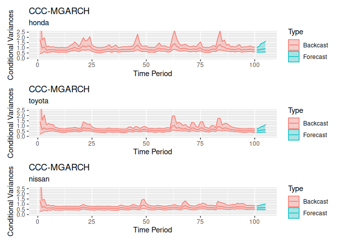

<!-- README.md is generated from README.Rmd. Please edit that file -->
<!-- knit with rmarkdown::render("README.Rmd", output_format = "md_document") -->
<!-- badges: start -->

<!-- badges: end -->

bmgarch
=======

`bmgarch` estimates Bayesian multivariate generalized autoregressive
conditional heteroskedasticity (MGARCH) models. Currently, bmgarch
supports ARMA(1,1) and intercept-only (Constant) mean structures, and a
variety of MGARCH(P,Q) parameterizations. In increasing order of
complexity:

-   CCC(P, Q): Constant Conditional Correlation
-   DCC(P, Q): Dynamic Conditional Correlation
-   BEKK(P, Q): Baba, Engle, Kraft, and Kroner
-   pdBEKK(P, Q): BEKK(P, Q) with positive diagonal constraints

Installation
------------

`bmgarch` is available on CRAN and can be installed with:

    install.packages('bmgarch')

Linux users may need to install `libv8` prior to installing `bmgarch`.
For example, in Ubuntu, run `sudo apt install libv8-dev` before
installing the package from CRAN or github. For those who’s distro
installs `libnode-dev` instead of `libv8-dev`, run
`install.packages("V8")` in R prior to installing `bmgarch` (during
installation`rstan` looks explicitly for V8).

The development version can be installed from
[GitHub](https://github.com/) with:

    devtools::install_github("ph-rast/bmgarch")

How to cite this package
------------------------

Please add following citation when referring to to this package:

Rast, P., Martin, S. R., Liu, S., & Williams, D. R. (in press). A New
Frontier for Studying Within-Person Variability: Bayesian Multivariate
Generalized Autoregressive Conditional Heteroskedasticity Models.
*Psychological Methods*.
<a href="https://doi.org/10.1037/met0000357" class="uri">https://doi.org/10.1037/met0000357</a>

Examples:
---------

We present two examples, one with behavioral data and one with stocks
from three major Japanese automakers.

Example 1: Behavioral Data
--------------------------

In this example, we use the pdBEKK(1,1) model for the variances, and an
intercept-only model for the means.

    library(bmgarch)

    data(panas)
    head(panas)
    #>      Pos    Neg
    #> 1 -2.193 -2.419
    #> 2  1.567 -0.360
    #> 3 -0.124 -1.202
    #> 4  0.020 -1.311
    #> 5 -0.150  2.004
    #> 6  3.877  1.008

    # Fit pdBEKK(1, 1) with ARMA(1,1) on the mean structure.
    fit <- bmgarch(panas,
                   parameterization = "pdBEKK",
                   iterations = 1000,
                   P = 1, Q = 1,
                   distribution = "Student_t",
                   meanstructure = "arma")
    #> 
    #> CHECKING DATA AND PREPROCESSING FOR MODEL 'pdBEKKMGARCH' NOW.
    #> 
    #> COMPILING MODEL 'pdBEKKMGARCH' NOW.
    #> 
    #> STARTING SAMPLER FOR MODEL 'pdBEKKMGARCH' NOW.

### Parameter estimates

    summary(fit)
    #> Model: pdBEKK-MGARCH
    #> Basic Specification: H_t = D_t R D_t
    #> H_t = C + A'[y_(t-1)*y'_(t-1)]A + B'H_(t-1)B
    #> 
    #> Distribution:  Student_t
    #> ---
    #> Iterations:  1000
    #> Chains:  4
    #> Date:  Mon Jul 26 14:08:44 2021
    #> Elapsed time (min):  16.4
    #> 
    #> ---
    #> Constant correlation, R (diag[C]*R*diag[C]):
    #> 
    #>         mean   sd  mdn  2.5% 97.5% n_eff Rhat
    #> R_Ng-Ps 0.15 0.46 0.31 -0.84  0.89 28.91 1.07
    #> 
    #> 
    #> Constant variances (diag[C]):
    #> 
    #>        mean   sd  mdn 2.5% 97.5%  n_eff Rhat
    #> var_Ps 0.56 0.73 0.31 0.02  3.04 214.26 1.04
    #> var_Ng 1.39 0.38 1.48 0.46  1.94  11.14 1.15
    #> 
    #> 
    #> MGARCH(1,1) estimates for A:
    #> 
    #>         mean   sd  mdn  2.5% 97.5%  n_eff Rhat
    #> A_Ps-Ps 0.34 0.09 0.33  0.15  0.53 502.52 1.01
    #> A_Ng-Ps 0.06 0.07 0.06 -0.08  0.20 622.30 1.02
    #> A_Ps-Ng 0.09 0.14 0.10 -0.22  0.31   6.68 1.24
    #> A_Ng-Ng 0.37 0.12 0.37  0.06  0.61 222.32 1.03
    #> 
    #> 
    #> MGARCH(1,1) estimates for B:
    #> 
    #>          mean   sd   mdn  2.5% 97.5% n_eff Rhat
    #> B_Ps-Ps  0.77 0.21  0.87  0.12  0.94 55.70 1.07
    #> B_Ng-Ps -0.10 0.13 -0.13 -0.39  0.19 55.40 1.05
    #> B_Ps-Ng  0.20 0.38  0.19 -0.67  1.05 20.46 1.09
    #> B_Ng-Ng  0.31 0.18  0.31  0.02  0.69 84.81 1.07
    #> 
    #> 
    #> ARMA(1,1) estimates on the location:
    #> 
    #>                  mean   sd   mdn  2.5% 97.5% n_eff Rhat
    #> (Intercept)_Pos -0.08 0.18 -0.06 -0.33  0.28  4.27 1.39
    #> (Intercept)_Neg  0.11 0.11  0.11 -0.13  0.31  8.91 1.16
    #> Phi_Pos-Pos     -0.19 0.43 -0.18 -0.74  0.56  4.35 1.38
    #> Phi_Pos-Neg      0.00 0.47  0.05 -0.90  0.74  7.99 1.19
    #> Phi_Neg-Pos      0.11 0.54 -0.03 -0.72  0.91  2.73 1.93
    #> Phi_Neg-Neg      0.15 0.41  0.27 -0.77  0.84 54.27 1.07
    #> Theta_Pos-Pos    0.13 0.48  0.12 -0.69  0.75  3.95 1.45
    #> Theta_Pos-Neg   -0.07 0.47 -0.16 -0.85  0.80 10.11 1.17
    #> Theta_Neg-Pos   -0.09 0.56  0.05 -0.93  0.74  2.67 1.98
    #> Theta_Neg-Neg   -0.17 0.43 -0.30 -0.89  0.77 56.76 1.07
    #> 
    #> 
    #> Df constant student_t (nu):
    #> 
    #>   mean     sd    mdn   2.5%  97.5%  n_eff   Rhat 
    #>  68.21  39.27  58.65  15.81 137.59   3.06   1.67 
    #> 
    #> 
    #> Log density posterior estimate:
    #> 
    #>    mean      sd     mdn    2.5%   97.5%   n_eff    Rhat 
    #> -803.58    5.23 -804.09 -813.53 -793.40   28.32    1.12

### Forecasted values

    fit.fc <- forecast(fit, ahead = 5)

    fit.fc
    #> ---
    #> [Mean] Forecast for 5 ahead:
    #> 
    #> Pos :
    #>       
    #> period  mean   sd   mdn  2.5% 97.5%   n_eff Rhat
    #>    201 -0.37 2.95 -0.40 -6.11  5.78 1879.77    1
    #>    202 -0.20 2.79 -0.17 -5.76  5.44 1981.61    1
    #>    203 -0.20 2.64 -0.22 -5.22  4.91 1931.71    1
    #>    204 -0.21 2.71 -0.18 -5.56  5.13 1729.28    1
    #>    205 -0.13 2.65 -0.10 -5.40  5.13 1707.32    1
    #> Neg :
    #>       
    #> period mean   sd  mdn  2.5% 97.5%   n_eff Rhat
    #>    201 0.37 1.53 0.41 -2.59  3.32 1740.50    1
    #>    202 0.24 1.59 0.19 -2.95  3.41 1104.70    1
    #>    203 0.33 1.54 0.34 -2.86  3.17 1813.08    1
    #>    204 0.19 1.57 0.16 -2.92  3.27 1832.20    1
    #>    205 0.18 1.55 0.22 -2.97  3.09 1848.51    1
    #> ---
    #> [Variance] Forecast for 5 ahead:
    #> 
    #> Pos :
    #>       
    #> period mean   sd  mdn 2.5% 97.5%   n_eff Rhat
    #>    201 8.14 2.30 8.04 4.15 13.17  263.72 1.01
    #>    202 7.52 3.31 7.15 3.51 14.52  549.15 1.00
    #>    203 7.00 3.46 6.38 3.36 15.05  770.97 1.00
    #>    204 6.62 3.90 5.85 3.17 14.66 1030.37 1.00
    #>    205 6.39 3.95 5.43 2.92 15.33  978.90 1.00
    #> Neg :
    #>       
    #> period mean   sd  mdn 2.5% 97.5%   n_eff Rhat
    #>    201 2.04 0.42 2.02 1.36  2.94   26.26 1.09
    #>    202 2.30 0.72 2.16 1.41  4.06  223.41 1.03
    #>    203 2.32 0.83 2.16 1.43  4.22  438.24 1.01
    #>    204 2.31 0.83 2.14 1.41  4.26  587.74 1.01
    #>    205 2.31 0.97 2.15 1.42  4.06 1131.01 1.01
    #> [Correlation] Forecast for 5 ahead:
    #> 
    #> Neg_Pos :
    #>       
    #> period  mean   sd   mdn  2.5% 97.5% n_eff Rhat
    #>    201 -0.12 0.17 -0.14 -0.38  0.22 18.27 1.13
    #>    202 -0.11 0.21 -0.13 -0.45  0.32 33.98 1.08
    #>    203 -0.10 0.21 -0.12 -0.46  0.34 41.03 1.07
    #>    204 -0.09 0.20 -0.10 -0.44  0.34 39.23 1.07
    #>    205 -0.07 0.20 -0.08 -0.43  0.34 44.38 1.07

    plot(fit.fc, askNewPage = FALSE, type = "var")

    plot(fit.fc, askNewPage = FALSE, type = "cor")

Example 2: Stocks
-----------------

Here we use the first 100 days of Stata’s stocks data on daily lagged
returns of three Japanese automakers, Toyota, Nissan, and Honda.

    library(bmgarch)

    data(stocks)
    head(stocks)
    #>         date t       toyota       nissan        honda
    #> 1 2003-01-02 1  0.015167475  0.029470444  0.031610250
    #> 2 2003-01-03 2  0.004820108  0.008173466  0.002679110
    #> 3 2003-01-06 3  0.019958735  0.013064146 -0.001606464
    #> 4 2003-01-07 4 -0.013322592 -0.007444382 -0.011317968
    #> 5 2003-01-08 5 -0.027001143 -0.018856525 -0.016944885
    #> 6 2003-01-09 6  0.011634588  0.016986847  0.013687611

Ease computation by first standardizing the time series

    stocks.z <- scale(stocks[,c("toyota", "nissan", "honda")])
    head(stocks.z )
    #>       toyota     nissan       honda
    #> 1  0.8151655  1.3417896  1.52836901
    #> 2  0.2517820  0.3687089  0.11213515
    #> 3  1.0760354  0.5921691 -0.09765177
    #> 4 -0.7360344 -0.3448866 -0.57304819
    #> 5 -1.4807910 -0.8663191 -0.84849638
    #> 6  0.6228102  0.7714013  0.65102202

    # Fit CCC(1, 1) with constant on the mean structure.
    fit1 <- bmgarch(stocks.z[1:100, c("toyota", "nissan", "honda")],
                    parameterization = "CCC",
                    iterations = 1000,
                    P = 1, Q = 1,
                    distribution = "Student_t",
                    meanstructure = "constant")
    #> 
    #> CHECKING DATA AND PREPROCESSING FOR MODEL 'CCCMGARCH' NOW.
    #> 
    #> COMPILING MODEL 'CCCMGARCH' NOW.
    #> 
    #> STARTING SAMPLER FOR MODEL 'CCCMGARCH' NOW.

### Parameter Estimates

    summary( fit1 )
    #> Model: CCC-MGARCH
    #> Basic Specification: H_t = D_t R D_t
    #>  diag(D_t) = sqrt(h_[ii,t]) = c_h + a_h*y^2_[t-1] + b_h*h_[ii, t-1
    #> 
    #> Distribution:  Student_t
    #> ---
    #> Iterations:  1000
    #> Chains:  4
    #> Date:  Mon Jul 26 14:10:02 2021
    #> Elapsed time (min):  0.94
    #> 
    #> GARCH(1,1)  estimates for conditional variance:
    #> 
    #>            mean   sd  mdn 2.5% 97.5%   n_eff Rhat
    #> a_h_1,ty   0.10 0.09 0.08 0.00  0.33 2095.63    1
    #> a_h_1,ns   0.08 0.07 0.06 0.00  0.29 2706.15    1
    #> a_h_1,hn   0.11 0.08 0.09 0.01  0.31 2354.31    1
    #> b_h_1,ty   0.46 0.18 0.47 0.10  0.79 1691.03    1
    #> b_h_1,ns   0.37 0.19 0.35 0.07  0.76 1043.90    1
    #> b_h_1,hn   0.39 0.18 0.38 0.08  0.76 1828.05    1
    #> c_h_var_ty 0.28 0.13 0.26 0.08  0.55 1505.54    1
    #> c_h_var_ns 0.36 0.13 0.36 0.12  0.62 1089.92    1
    #> c_h_var_hn 0.44 0.16 0.43 0.15  0.80 1729.85    1
    #> 
    #> 
    #> Constant correlation (R) coefficients:
    #> 
    #>         mean   sd  mdn 2.5% 97.5%   n_eff Rhat
    #> R_ns-ty 0.65 0.06 0.65 0.52  0.75 2313.68    1
    #> R_hn-ty 0.73 0.05 0.73 0.62  0.82 2323.35    1
    #> R_hn-ns 0.64 0.07 0.65 0.50  0.75 2570.60    1
    #> 
    #> 
    #> Intercept estimates on the location:
    #> 
    #>                     mean   sd   mdn  2.5% 97.5%   n_eff Rhat
    #> (Intercept)_toyota -0.09 0.08 -0.09 -0.25  0.06 1504.50    1
    #> (Intercept)_nissan -0.01 0.08 -0.01 -0.17  0.15 1389.28    1
    #> (Intercept)_honda  -0.02 0.09 -0.02 -0.21  0.16 1398.70    1
    #> 
    #> 
    #> Df constant student_t (nu):
    #> 
    #>    mean      sd     mdn    2.5%   97.5%   n_eff    Rhat 
    #>   32.28   23.85   25.06    6.99   96.64 1749.55    1.00 
    #> 
    #> 
    #> Log density posterior estimate:
    #> 
    #>    mean      sd     mdn    2.5%   97.5%   n_eff    Rhat 
    #> -178.28    5.20 -177.90 -189.27 -169.43  700.87    1.00

### Forecasted Values

Forecast volatility 10 days ahead

    fc <- forecast(fit1, ahead = 10 )
    fc
    #> ---
    #> [Variance] Forecast for 10 ahead:
    #> 
    #> toyota :
    #>       
    #> period mean   sd  mdn 2.5% 97.5%   n_eff Rhat
    #>    101 0.54 0.11 0.53 0.34  0.78 1971.10    1
    #>    102 0.59 0.17 0.57 0.35  0.95 1905.79    1
    #>    103 0.61 0.25 0.58 0.35  0.97 1883.18    1
    #>    104 0.63 0.31 0.59 0.36  1.15 1768.54    1
    #>    105 0.65 0.32 0.60 0.37  1.18 1824.45    1
    #>    106 0.66 0.32 0.60 0.37  1.23 1926.02    1
    #>    107 0.66 0.27 0.61 0.37  1.29 2126.20    1
    #>    108 0.67 0.34 0.61 0.38  1.30 2152.52    1
    #>    109 0.67 0.35 0.61 0.37  1.30 1962.60    1
    #>    110 0.68 0.55 0.61 0.38  1.33 1652.51    1
    #> nissan :
    #>       
    #> period mean   sd  mdn 2.5% 97.5%   n_eff Rhat
    #>    101 0.61 0.11 0.60 0.43  0.85 2104.92    1
    #>    102 0.65 0.17 0.62 0.43  1.03 2140.60    1
    #>    103 0.66 0.20 0.63 0.43  1.06 2128.73    1
    #>    104 0.66 0.19 0.63 0.43  1.09 1917.27    1
    #>    105 0.67 0.21 0.63 0.43  1.15 1827.45    1
    #>    106 0.68 0.26 0.64 0.43  1.18 1875.37    1
    #>    107 0.68 0.22 0.64 0.43  1.17 1845.28    1
    #>    108 0.68 0.23 0.64 0.43  1.19 1933.68    1
    #>    109 0.68 0.29 0.64 0.43  1.19 1891.26    1
    #>    110 0.68 0.24 0.64 0.43  1.23 2076.55    1
    #> honda :
    #>       
    #> period mean   sd  mdn 2.5% 97.5%   n_eff Rhat
    #>    101 0.77 0.14 0.76 0.54  1.06 1962.05    1
    #>    102 0.83 0.22 0.80 0.53  1.33 2009.84    1
    #>    103 0.87 0.30 0.82 0.55  1.47 1966.79    1
    #>    104 0.88 0.32 0.83 0.57  1.58 2036.94    1
    #>    105 0.91 0.45 0.84 0.57  1.66 2065.01    1
    #>    106 0.92 0.46 0.85 0.57  1.84 2153.05    1
    #>    107 0.93 0.46 0.85 0.57  1.73 2149.53    1
    #>    108 0.93 0.56 0.85 0.56  1.75 2062.83    1
    #>    109 0.93 0.59 0.84 0.57  1.76 1994.14    1
    #>    110 0.93 0.51 0.84 0.56  1.79 2057.91    1

    plot(fc,askNewPage = FALSE, type = 'var' )

### Ensemble Methods

Here we illustrate how to obtain model weights across three models.
These weights will be used to compute weighted forecasts, thus, taking
into account that we do not have a single best model.

Add two additional models, one with CCC(2,2) and a DCC(1,1)

    # Fit CCC(1, 1) with constant on the mean structure.
    fit2 <- bmgarch(stocks.z[1:100, c("toyota", "nissan", "honda")],
                    parameterization = "CCC",
                    iterations = 1000,
                    P = 2, Q = 2,
                    distribution = "Student_t",
                    meanstructure = "constant")
    #> 
    #> CHECKING DATA AND PREPROCESSING FOR MODEL 'CCCMGARCH' NOW.
    #> 
    #> COMPILING MODEL 'CCCMGARCH' NOW.
    #> 
    #> STARTING SAMPLER FOR MODEL 'CCCMGARCH' NOW.

    fit3 <- bmgarch(stocks.z[1:100, c("toyota", "nissan", "honda")],
                    parameterization = "DCC",
                    iterations = 1000,
                    P = 1, Q = 1,
                    distribution = "Student_t",
                    meanstructure = "arma")
    #> 
    #> CHECKING DATA AND PREPROCESSING FOR MODEL 'DCCMGARCH' NOW.
    #> 
    #> COMPILING MODEL 'DCCMGARCH' NOW.
    #> 
    #> STARTING SAMPLER FOR MODEL 'DCCMGARCH' NOW.

The DCC(1,1) model also incorporates an ARMA(1,1) meanstructure. The
output will have the according information:

    summary( fit3 )
    #> Model: DCC-MGARCH
    #> Basic Specification: H_t = D_t R D_t
    #>  diag(D_t) = sqrt(h_ii,t) = c_h + a_h*y^2_[t-1] + b_h*h_[ii,t-1]
    #>  R_t = Q^[-1]_t Q_t Q^[-1]_t = ( 1 - a_q - b_q)S + a_q(u_[t-1]u'_[t-1]) + b_q(Q_[t-1])
    #> 
    #> Distribution:  Student_t
    #> ---
    #> Iterations:  1000
    #> Chains:  4
    #> Date:  Mon Jul 26 14:28:09 2021
    #> Elapsed time (min):  16.38
    #> 
    #> GARCH(1,1)  estimates for conditional variance on D:
    #> 
    #>            mean   sd  mdn 2.5% 97.5% n_eff Rhat
    #> a_h_1,ty   0.20 0.18 0.14 0.01  0.50  2.73 1.93
    #> a_h_1,ns   0.09 0.07 0.07 0.01  0.26 18.15 1.09
    #> a_h_1,hn   0.16 0.11 0.11 0.00  0.32  3.40 1.57
    #> b_h_1,ty   0.45 0.15 0.44 0.15  0.70  6.62 1.25
    #> b_h_1,ns   0.38 0.19 0.41 0.09  0.78  5.08 1.30
    #> b_h_1,hn   0.44 0.15 0.45 0.15  0.78  9.94 1.16
    #> c_h_var_ty 0.25 0.09 0.25 0.12  0.50 18.04 1.10
    #> c_h_var_ns 0.32 0.11 0.30 0.10  0.53  7.03 1.22
    #> c_h_var_hn 0.36 0.14 0.34 0.15  0.66  5.57 1.27
    #> 
    #> 
    #> GARCH(1,1) estimates for conditional variance on Q:
    #> 
    #>     mean   sd  mdn 2.5% 97.5% n_eff Rhat
    #> a_q 0.32 0.14 0.38 0.05  0.49  2.68 1.99
    #> b_q 0.19 0.12 0.21 0.03  0.50  6.12 1.23
    #> 
    #> 
    #> Unconditional correlation 'S' in Q:
    #> 
    #>         mean   sd  mdn 2.5% 97.5% n_eff Rhat
    #> S_ns-ty 0.55 0.15 0.61 0.31  0.73  2.37 2.49
    #> S_hn-ty 0.64 0.13 0.69 0.42  0.82  2.50 2.28
    #> S_hn-ns 0.57 0.08 0.54 0.43  0.73  6.00 1.25
    #> 
    #> 
    #> ARMA(1,1) estimates on the location:
    #> 
    #>                      mean   sd   mdn  2.5% 97.5% n_eff Rhat
    #> (Intercept)_toyota  -0.05 0.08 -0.04 -0.23  0.06 10.66 1.16
    #> (Intercept)_nissan   0.08 0.12  0.08 -0.15  0.25  2.92 1.79
    #> (Intercept)_honda    0.06 0.12  0.10 -0.22  0.20  3.83 1.46
    #> Phi_toyota-toyota    0.03 0.26  0.04 -0.57  0.57 96.58 1.04
    #> Phi_toyota-nissan   -0.17 0.40 -0.02 -0.71  0.66  3.73 1.52
    #> Phi_toyota-honda     0.01 0.36  0.12 -0.56  0.74  4.73 1.37
    #> Phi_nissan-toyota    0.38 0.34  0.37 -0.47  0.82  7.06 1.24
    #> Phi_nissan-nissan   -0.34 0.33 -0.35 -0.76  0.51  6.53 1.24
    #> Phi_nissan-honda    -0.06 0.34 -0.04 -0.72  0.69  8.90 1.21
    #> Phi_honda-toyota    -0.22 0.43 -0.27 -0.95  0.54  3.87 1.47
    #> Phi_honda-nissan     0.08 0.39  0.21 -0.53  0.80  4.11 1.42
    #> Phi_honda-honda     -0.29 0.34 -0.34 -0.67  0.43  4.05 1.41
    #> Theta_toyota-toyota -0.14 0.36 -0.12 -0.71  0.52  4.50 1.37
    #> Theta_toyota-nissan  0.37 0.40  0.36 -0.53  0.89  3.73 1.51
    #> Theta_toyota-honda   0.00 0.49 -0.09 -0.68  0.67  2.65 2.02
    #> Theta_nissan-toyota -0.40 0.36 -0.38 -0.82  0.47  5.76 1.30
    #> Theta_nissan-nissan  0.42 0.39  0.39 -0.45  0.91  3.59 1.52
    #> Theta_nissan-honda  -0.02 0.34 -0.11 -0.71  0.63  7.06 1.25
    #> Theta_honda-toyota  -0.11 0.47 -0.01 -0.81  0.61  3.13 1.69
    #> Theta_honda-nissan   0.03 0.48 -0.10 -0.76  0.68  3.18 1.66
    #> Theta_honda-honda    0.48 0.41  0.60 -0.39  0.96  3.23 1.62
    #> 
    #> 
    #> Df constant student_t (nu):
    #> 
    #>  mean    sd   mdn  2.5% 97.5% n_eff  Rhat 
    #> 46.90 20.77 45.05 11.06 98.39 28.90  1.06 
    #> 
    #> 
    #> Log density posterior estimate:
    #> 
    #>    mean      sd     mdn    2.5%   97.5%   n_eff    Rhat 
    #> -173.60    7.05 -172.65 -191.60 -163.15    3.63    1.55
    fc <- forecast(fit3, ahead =  10)

    plot( fc,askNewPage = FALSE, type =  'mean' ) 

### Compute Model Weights

Obtain model weights with either the stacking or the pseudo BMA method.
These methods are inherited from the `loo` package.

First, gather models to a `bmgarch_list`.

    ## use bmgarch_list function to collect bmgarch objects
    modfits <- bmgarch_list(fit1, fit2, fit3)

Compute model weights with the stacking method (default) and the the
approximate (default) leave-future-out cross validation (LFO CV). `L`
defines the minimal length of the time series before we start engaging
in cross-validation. Eg., for a time series with length 100, `L = 50`
reserves values 51–100 as the cross-validation sample. Note that the
standard is to use the approximate `backward` method to CV as it results
in fewest refits. Exact CV is also available with `exact` but not
encouraged as it results in refitting all CV models.

    mw <- model_weights(modfits, L = 50, method = 'stacking')
    #> 
    #> CHECKING DATA AND PREPROCESSING FOR MODEL 'CCCMGARCH' NOW.
    #> 
    #> COMPILING MODEL 'CCCMGARCH' NOW.
    #> 
    #> STARTING SAMPLER FOR MODEL 'CCCMGARCH' NOW.
    #> 
    #> CHECKING DATA AND PREPROCESSING FOR MODEL 'CCCMGARCH' NOW.
    #> 
    #> COMPILING MODEL 'CCCMGARCH' NOW.
    #> 
    #> STARTING SAMPLER FOR MODEL 'CCCMGARCH' NOW.
    #> 
    #> CHECKING DATA AND PREPROCESSING FOR MODEL 'CCCMGARCH' NOW.
    #> 
    #> COMPILING MODEL 'CCCMGARCH' NOW.
    #> 
    #> STARTING SAMPLER FOR MODEL 'CCCMGARCH' NOW.
    #> Using threshold  0.6 , model was refit  3  times, at observations 82 65 50 
    #> 
    #> CHECKING DATA AND PREPROCESSING FOR MODEL 'CCCMGARCH' NOW.
    #> 
    #> COMPILING MODEL 'CCCMGARCH' NOW.
    #> 
    #> STARTING SAMPLER FOR MODEL 'CCCMGARCH' NOW.
    #> 
    #> CHECKING DATA AND PREPROCESSING FOR MODEL 'CCCMGARCH' NOW.
    #> 
    #> COMPILING MODEL 'CCCMGARCH' NOW.
    #> 
    #> STARTING SAMPLER FOR MODEL 'CCCMGARCH' NOW.
    #> 
    #> CHECKING DATA AND PREPROCESSING FOR MODEL 'CCCMGARCH' NOW.
    #> 
    #> COMPILING MODEL 'CCCMGARCH' NOW.
    #> 
    #> STARTING SAMPLER FOR MODEL 'CCCMGARCH' NOW.
    #> Using threshold  0.6 , model was refit  3  times, at observations 79 72 62 
    #> 
    #> CHECKING DATA AND PREPROCESSING FOR MODEL 'DCCMGARCH' NOW.
    #> 
    #> COMPILING MODEL 'DCCMGARCH' NOW.
    #> 
    #> STARTING SAMPLER FOR MODEL 'DCCMGARCH' NOW.
    #> 
    #> CHECKING DATA AND PREPROCESSING FOR MODEL 'DCCMGARCH' NOW.
    #> 
    #> COMPILING MODEL 'DCCMGARCH' NOW.
    #> 
    #> STARTING SAMPLER FOR MODEL 'DCCMGARCH' NOW.
    #> 
    #> CHECKING DATA AND PREPROCESSING FOR MODEL 'DCCMGARCH' NOW.
    #> 
    #> COMPILING MODEL 'DCCMGARCH' NOW.
    #> 
    #> STARTING SAMPLER FOR MODEL 'DCCMGARCH' NOW.
    #> 
    #> CHECKING DATA AND PREPROCESSING FOR MODEL 'DCCMGARCH' NOW.
    #> 
    #> COMPILING MODEL 'DCCMGARCH' NOW.
    #> 
    #> STARTING SAMPLER FOR MODEL 'DCCMGARCH' NOW.
    #> 
    #> CHECKING DATA AND PREPROCESSING FOR MODEL 'DCCMGARCH' NOW.
    #> 
    #> COMPILING MODEL 'DCCMGARCH' NOW.
    #> 
    #> STARTING SAMPLER FOR MODEL 'DCCMGARCH' NOW.
    #> 
    #> CHECKING DATA AND PREPROCESSING FOR MODEL 'DCCMGARCH' NOW.
    #> 
    #> COMPILING MODEL 'DCCMGARCH' NOW.
    #> 
    #> STARTING SAMPLER FOR MODEL 'DCCMGARCH' NOW.
    #> 
    #> CHECKING DATA AND PREPROCESSING FOR MODEL 'DCCMGARCH' NOW.
    #> 
    #> COMPILING MODEL 'DCCMGARCH' NOW.
    #> 
    #> STARTING SAMPLER FOR MODEL 'DCCMGARCH' NOW.
    #> 
    #> CHECKING DATA AND PREPROCESSING FOR MODEL 'DCCMGARCH' NOW.
    #> 
    #> COMPILING MODEL 'DCCMGARCH' NOW.
    #> 
    #> STARTING SAMPLER FOR MODEL 'DCCMGARCH' NOW.
    #> 
    #> CHECKING DATA AND PREPROCESSING FOR MODEL 'DCCMGARCH' NOW.
    #> 
    #> COMPILING MODEL 'DCCMGARCH' NOW.
    #> 
    #> STARTING SAMPLER FOR MODEL 'DCCMGARCH' NOW.
    #> 
    #> CHECKING DATA AND PREPROCESSING FOR MODEL 'DCCMGARCH' NOW.
    #> 
    #> COMPILING MODEL 'DCCMGARCH' NOW.
    #> 
    #> STARTING SAMPLER FOR MODEL 'DCCMGARCH' NOW.
    #> 
    #> CHECKING DATA AND PREPROCESSING FOR MODEL 'DCCMGARCH' NOW.
    #> 
    #> COMPILING MODEL 'DCCMGARCH' NOW.
    #> 
    #> STARTING SAMPLER FOR MODEL 'DCCMGARCH' NOW.
    #> 
    #> CHECKING DATA AND PREPROCESSING FOR MODEL 'DCCMGARCH' NOW.
    #> 
    #> COMPILING MODEL 'DCCMGARCH' NOW.
    #> 
    #> STARTING SAMPLER FOR MODEL 'DCCMGARCH' NOW.
    #> Using threshold  0.6 , model was refit  12  times, at observations 96 94 89 82 80 74 72 67 60 58 52 50

    ## Return model weights:
    mw
    #> Method: stacking
    #> ------
    #>        weight
    #> model1 0.385 
    #> model2 0.615 
    #> model3 0.000

### Weighted Forecasting

Use model weights to obtain weighted forecasts. Here we will forecast 5
days ahead.

    w_fc <- forecast(modfits, ahead = 5, weights = mw )
    w_fc
    #> ---
    #> LFO-weighted forecasts across  3 models.
    #> ---
    #> [Mean] Forecast for 5 ahead:
    #> 
    #> toyota :
    #>       
    #> period  mean   sd   mdn  2.5% 97.5% n_eff Rhat
    #>    101 -0.09 0.57 -0.08 -1.19  1.05    NA   NA
    #>    102 -0.09 0.55 -0.09 -1.21  0.99    NA   NA
    #>    103 -0.09 0.57 -0.09 -1.20  1.03    NA   NA
    #>    104 -0.09 0.61 -0.09 -1.30  1.10    NA   NA
    #>    105 -0.08 0.61 -0.09 -1.26  1.18    NA   NA
    #> nissan :
    #>       
    #> period  mean   sd   mdn  2.5% 97.5% n_eff Rhat
    #>    101  0.00 0.62  0.01 -1.28  1.18    NA   NA
    #>    102  0.01 0.61  0.01 -1.20  1.17    NA   NA
    #>    103 -0.02 0.62 -0.02 -1.21  1.23    NA   NA
    #>    104 -0.02 0.64 -0.02 -1.32  1.27    NA   NA
    #>    105  0.01 0.64  0.02 -1.28  1.27    NA   NA
    #> honda :
    #>       
    #> period  mean   sd   mdn  2.5% 97.5% n_eff Rhat
    #>    101 -0.03 0.69 -0.01 -1.43  1.31    NA   NA
    #>    102 -0.02 0.68 -0.03 -1.39  1.31    NA   NA
    #>    103 -0.04 0.72 -0.04 -1.45  1.39    NA   NA
    #>    104 -0.03 0.74 -0.03 -1.53  1.41    NA   NA
    #>    105 -0.03 0.74 -0.01 -1.49  1.43    NA   NA
    #> ---
    #> [Variance] Forecast for 5 ahead:
    #> 
    #> toyota :
    #>       
    #> period mean   sd  mdn 2.5% 97.5% n_eff Rhat
    #>    101 0.53 0.08 0.53 0.38  0.69    NA   NA
    #>    102 0.56 0.12 0.55 0.39  0.79    NA   NA
    #>    103 0.59 0.13 0.58 0.40  0.89    NA   NA
    #>    104 0.61 0.14 0.59 0.41  0.95    NA   NA
    #>    105 0.63 0.19 0.60 0.42  1.06    NA   NA
    #> nissan :
    #>       
    #> period mean   sd  mdn 2.5% 97.5% n_eff Rhat
    #>    101 0.62 0.08 0.62 0.48  0.80    NA   NA
    #>    102 0.64 0.11 0.63 0.48  0.88    NA   NA
    #>    103 0.66 0.12 0.64 0.48  0.94    NA   NA
    #>    104 0.67 0.13 0.64 0.49  0.99    NA   NA
    #>    105 0.67 0.14 0.65 0.49  1.00    NA   NA
    #> honda :
    #>       
    #> period mean   sd  mdn 2.5% 97.5% n_eff Rhat
    #>    101 0.77 0.10 0.76 0.60  1.01    NA   NA
    #>    102 0.81 0.17 0.79 0.58  1.14    NA   NA
    #>    103 0.86 0.24 0.82 0.60  1.34    NA   NA
    #>    104 0.88 0.25 0.84 0.60  1.45    NA   NA
    #>    105 0.91 0.33 0.85 0.61  1.59    NA   NA
    #> [Correlation] Forecast for 5 ahead:
    #> 
    #> nissan_toyota :
    #>       
    #> period mean   sd  mdn 2.5% 97.5% n_eff Rhat
    #>    101 0.65 0.05 0.65 0.55  0.73    NA   NA
    #>    102 0.65 0.05 0.65 0.55  0.73    NA   NA
    #>    103 0.65 0.05 0.65 0.55  0.73    NA   NA
    #>    104 0.65 0.05 0.65 0.55  0.73    NA   NA
    #>    105 0.65 0.05 0.65 0.55  0.73    NA   NA
    #> honda_toyota :
    #>       
    #> period mean   sd  mdn 2.5% 97.5% n_eff Rhat
    #>    101 0.73 0.04 0.73 0.65   0.8    NA   NA
    #>    102 0.73 0.04 0.73 0.65   0.8    NA   NA
    #>    103 0.73 0.04 0.73 0.65   0.8    NA   NA
    #>    104 0.73 0.04 0.73 0.65   0.8    NA   NA
    #>    105 0.73 0.04 0.73 0.65   0.8    NA   NA
    #> honda_nissan :
    #>       
    #> period mean   sd  mdn 2.5% 97.5% n_eff Rhat
    #>    101 0.64 0.05 0.64 0.55  0.72    NA   NA
    #>    102 0.64 0.05 0.64 0.55  0.72    NA   NA
    #>    103 0.64 0.05 0.64 0.55  0.72    NA   NA
    #>    104 0.64 0.05 0.64 0.55  0.72    NA   NA
    #>    105 0.64 0.05 0.64 0.55  0.72    NA   NA

Plot the weighted forecast. Save plots into a ggplot object and
post-process

    plt <- plot(w_fc, askNewPage = FALSE, type =  'var' )

    library( patchwork )
    ( plt$honda  + ggplot2::coord_cartesian(ylim = c(0, 2.5 ) ) ) /
    ( plt$toyota + ggplot2::coord_cartesian(ylim = c(0, 2.5 ) ) ) /
    ( plt$nissan + ggplot2::coord_cartesian(ylim = c(0, 2.5 ) ) ) 
    #> Coordinate system already present. Adding new coordinate system, which will replace the existing one.
    #> Coordinate system already present. Adding new coordinate system, which will replace the existing one.
    #> Coordinate system already present. Adding new coordinate system, which will replace the existing one.

### Predictors for Constant Variance (C)

We can add predictors for the constant variance term, c or C, in the
MGARCH model with the option `xC =` The predictors need to be of the
same dimension as the time-series object. For example, with three
time-series of lenght 100, the predictor needs to be entered as a 100 by
3 matrix as well.

As an example, we will add `nissan` as the predictor for C in a
bivariate MGARCH:

    # Fit CCC(1, 1) with constant on the mean structure.
    fitx <- bmgarch(stocks.z[1:100, c("toyota", "honda")],
                    xC = stocks.z[1:100, c("nissan", "nissan")],
                    parameterization = "CCC",
                    iterations = 1000,
                    P = 2, Q = 2,
                    distribution = "Student_t",
                    meanstructure = "constant")
    #> 
    #> CHECKING DATA AND PREPROCESSING FOR MODEL 'CCCMGARCH' NOW.
    #> 
    #> COMPILING MODEL 'CCCMGARCH' NOW.
    #> 
    #> STARTING SAMPLER FOR MODEL 'CCCMGARCH' NOW.

The predictors for C are on a log scale in section `Exogenous predictor`

    summary(fitx)
    #> Model: CCC-MGARCH
    #> Basic Specification: H_t = D_t R D_t
    #>  diag(D_t) = sqrt(h_[ii,t]) = c_h + a_h*y^2_[t-1] + b_h*h_[ii, t-1
    #> 
    #> Distribution:  Student_t
    #> ---
    #> Iterations:  1000
    #> Chains:  4
    #> Date:  Mon Jul 26 16:57:49 2021
    #> Elapsed time (min):  0.79
    #> 
    #> GARCH(2,2)  estimates for conditional variance:
    #> 
    #>            mean   sd  mdn 2.5% 97.5%   n_eff Rhat
    #> a_h_1,ty   0.09 0.08 0.06 0.00  0.32 2005.72    1
    #> a_h_1,hn   0.08 0.07 0.05 0.00  0.28 2921.30    1
    #> a_h_2,ty   0.09 0.09 0.07 0.00  0.34 1998.68    1
    #> a_h_2,hn   0.12 0.12 0.08 0.00  0.46 1693.11    1
    #> b_h_1,ty   0.20 0.16 0.16 0.01  0.57 1882.91    1
    #> b_h_1,hn   0.19 0.15 0.15 0.01  0.54 2038.49    1
    #> b_h_2,ty   0.26 0.16 0.24 0.01  0.61 1630.10    1
    #> b_h_2,hn   0.19 0.16 0.15 0.01  0.58 1866.96    1
    #> c_h_var_ty 0.23 0.11 0.21 0.08  0.49 1172.64    1
    #> c_h_var_hn 0.40 0.16 0.38 0.13  0.74 1329.28    1
    #> 
    #> 
    #> Constant correlation (R) coefficients:
    #> 
    #>         mean   sd  mdn 2.5% 97.5%   n_eff Rhat
    #> R_hn-ty 0.73 0.05 0.73 0.61  0.82 2486.07    1
    #> 
    #> 
    #> Intercept estimates on the location:
    #> 
    #>                     mean   sd   mdn  2.5% 97.5%   n_eff Rhat
    #> (Intercept)_toyota -0.09 0.09 -0.09 -0.26  0.08 1495.80    1
    #> (Intercept)_honda  -0.04 0.09 -0.04 -0.23  0.14 1602.52    1
    #> 
    #> 
    #> Exogenous predictor (beta1 on log scale: c = exp( beta_0 + beta_1*x ):
    #> 
    #>           mean   sd   mdn  2.5% 97.5%   n_eff Rhat
    #> beta0_ty -1.57 0.48 -1.54 -2.58 -0.72 1151.80    1
    #> beta0_hn -1.01 0.45 -0.97 -2.01 -0.31 1137.41    1
    #> beta_ty  -0.18 0.37 -0.18 -0.89  0.61 1495.19    1
    #> beta_hn   0.03 0.34  0.06 -0.70  0.65 1491.22    1
    #> 
    #> 
    #> Df constant student_t (nu):
    #> 
    #>    mean      sd     mdn    2.5%   97.5%   n_eff    Rhat 
    #>   45.96   28.40   40.08    8.88  114.66 2797.27    1.00 
    #> 
    #> 
    #> Log density posterior estimate:
    #> 
    #>    mean      sd     mdn    2.5%   97.5%   n_eff    Rhat 
    #> -129.83    4.13 -129.58 -139.05 -122.92  686.82    1.00

We can generate forecasts given the known values of the predictor. Note
that the dimension of the predictor needs to match the number of
timepoints that we predict ahead and the number of variables, 5 by 2, in
this example:

    fc2x <- forecast(fitx, ahead = 5, xC = stocks.z[101:105, c("nissan", "nissan")])
    fc2x
    #> ---
    #> [Variance] Forecast for 5 ahead:
    #> 
    #> toyota :
    #>       
    #> period mean   sd  mdn 2.5% 97.5%   n_eff Rhat
    #>    101 0.47 0.11 0.46 0.28  0.71 1702.10    1
    #>    102 0.48 0.15 0.46 0.25  0.82 1869.44    1
    #>    103 0.51 0.20 0.48 0.24  0.95 1914.67    1
    #>    104 0.53 0.20 0.50 0.25  1.02 1904.14    1
    #>    105 0.58 0.25 0.53 0.27  1.19 1822.50    1
    #> honda :
    #>       
    #> period mean   sd  mdn 2.5% 97.5%   n_eff Rhat
    #>    101 0.78 0.16 0.77 0.50  1.10 2081.98    1
    #>    102 0.80 0.24 0.77 0.41  1.32 1789.11    1
    #>    103 0.88 0.33 0.82 0.42  1.68 1867.74    1
    #>    104 0.89 0.35 0.82 0.44  1.83 1940.78    1
    #>    105 0.92 0.51 0.83 0.47  1.93 1965.83    1

Community Guidelines
--------------------

1.  Contributions and suggestions to the software are always welcome.
    Please consult our [contribution guidelines](CONTRIBUTING.md) prior
    to submitting a pull request.
2.  Report issues or problems with the software using github’s [issue
    tracker](https://github.com/ph-rast/bmgarch/issues).
3.  Contributors must adhere to the [Code of
    Conduct](CODE_OF_CONDUCT.md).

Acknowledgment
--------------

This work was supported by the National Institute On Aging of the
National Institutes of Health under Award Number
[R01AG050720](https://reporter.nih.gov/project-details/9336761) to PR.
The content is solely the responsibility of the authors and does not
necessarily represent the official views of the funding agency.
