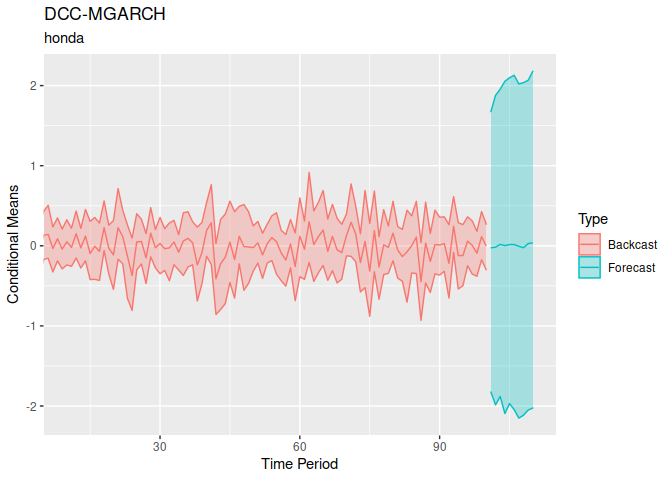
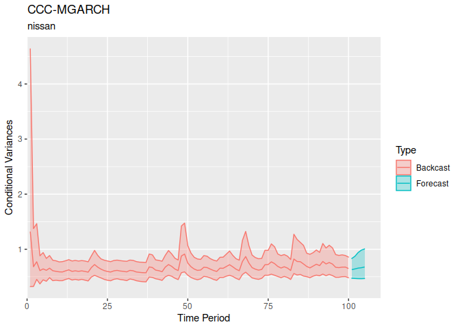

<!-- README.md is generated from README.Rmd. Please edit that file -->
<!-- knit with knitr::render("README.Rmd", output_format = "md_document") -->
<!-- badges: start -->

<!-- badges: end -->

bmgarch
=======

`bmgarch` estimates Bayesian multivariate generalized autoregressive
conditional heteroskedasticity (MGARCH) models. Currently, bmgarch
supports ARMA(1,1) and intercept-only (Constant) mean structures, and a
variety of MGARCH(P,Q) parameterizations. In increasing order of
complexity:

-   CCC(P, Q): Constant Conditional Correlation
-   DCC(P, Q): Dynamic Conditional Correlation
-   BEKK(P, Q): Baba, Engle, Kraft, and Kroner
-   pdBEKK(P, Q): BEKK(P, Q) with positive diagonal constraints

Installation
------------

`bmgarch` is not yet available on CRAN.

The development version can be installed from
[GitHub](https://github.com/) with:

    devtools::install_github("ph-rast/bmgarch")

Example 1: Behavioral Data
--------------------------

In this example, we use the pdBEKK(1,1) model for the variances, and an
intercept-only model for the means.

    library(bmgarch)

    data(panas)
    head(panas)
    #>      Pos    Neg
    #> 1 -2.193 -2.419
    #> 2  1.567 -0.360
    #> 3 -0.124 -1.202
    #> 4  0.020 -1.311
    #> 5 -0.150  2.004
    #> 6  3.877  1.008

    # Fit pdBEKK(1, 1) with ARMA(1,1) on the mean structure.
    fit <- bmgarch(panas,
                   parameterization = "pdBEKK",
                   iterations = 1000,
                   P = 1, Q = 1,
                   distribution = "Student_t",
                   meanstructure = "arma")
    #> 
    #> CHECKING DATA AND PREPROCESSING FOR MODEL 'pdBEKKMGARCH' NOW.
    #> 
    #> COMPILING MODEL 'pdBEKKMGARCH' NOW.
    #> 
    #> STARTING SAMPLER FOR MODEL 'pdBEKKMGARCH' NOW.

### Parameter estimates

    summary(fit)
    #> Model: pdBEKK-MGARCH
    #> Basic Specification: H_t = D_t R D_t
    #> H_t = C + A'[y_(t-1)*y'_(t-1)]A + B'H_(t-1)B
    #> 
    #> Distribution:  Student_t
    #> ---
    #> Iterations:  1000
    #> Chains:  4
    #> Date:  Sun Aug 23 01:42:04 2020
    #> Elapsed time (min):  16.68
    #> 
    #> ---
    #> Constant correlation, R (diag[C]*R*diag[C]):
    #> 
    #>         mean   sd  mdn  2.5% 97.5%  n_eff Rhat
    #> R_Ng-Ps 0.02 0.51 0.01 -0.91  0.92 825.46 1.01
    #> 
    #> 
    #> Constant variances (diag[C]):
    #> 
    #>        mean   sd  mdn 2.5% 97.5%  n_eff Rhat
    #> var_Ps 0.68 0.89 0.30 0.01  3.22 246.66 1.02
    #> var_Ng 1.23 0.42 1.28 0.19  1.92 254.35 1.00
    #> 
    #> 
    #> MGARCH(1,1) estimates for A:
    #> 
    #>         mean   sd  mdn  2.5% 97.5%  n_eff Rhat
    #> A_Ps-Ps 0.34 0.11 0.34  0.10  0.53 215.62 1.01
    #> A_Ng-Ps 0.06 0.08 0.06 -0.09  0.23 904.16 1.00
    #> A_Ps-Ng 0.05 0.14 0.05 -0.23  0.32 756.40 1.00
    #> A_Ng-Ng 0.40 0.12 0.40  0.16  0.62 832.65 1.01
    #> 
    #> 
    #> MGARCH(1,1) estimates for B:
    #> 
    #>          mean   sd   mdn  2.5% 97.5%  n_eff Rhat
    #> B_Ps-Ps  0.73 0.24  0.83  0.07  0.94 157.32 1.03
    #> B_Ng-Ps -0.11 0.16 -0.09 -0.51  0.19 226.55 1.01
    #> B_Ps-Ng  0.30 0.39  0.29 -0.58  1.14 346.78 1.02
    #> B_Ng-Ng  0.34 0.20  0.33  0.01  0.77 412.20 1.01
    #> 
    #> 
    #> ARMA(1,1) estimates on the location:
    #> 
    #>                  mean   sd   mdn  2.5% 97.5%  n_eff Rhat
    #> (Intercept)_Pos -0.01 0.15 -0.01 -0.33  0.28 846.77 1.00
    #> (Intercept)_Neg  0.08 0.12  0.07 -0.17  0.35 657.12 1.00
    #> Phi_Pos-Pos     -0.02 0.35 -0.01 -0.70  0.66 640.22 1.00
    #> Phi_Pos-Neg     -0.09 0.48 -0.12 -0.89  0.81 335.19 1.01
    #> Phi_Neg-Pos     -0.13 0.35 -0.14 -0.83  0.60 423.62 1.02
    #> Phi_Neg-Neg      0.03 0.43  0.02 -0.76  0.80 631.75 1.02
    #> Theta_Pos-Pos   -0.06 0.37 -0.06 -0.77  0.67 615.30 1.00
    #> Theta_Pos-Neg   -0.01 0.49  0.02 -0.92  0.84 323.77 1.01
    #> Theta_Neg-Pos    0.16 0.35  0.16 -0.57  0.83 389.17 1.02
    #> Theta_Neg-Neg   -0.04 0.44 -0.03 -0.83  0.78 603.98 1.02
    #> 
    #> 
    #> Df constant student_t (nu):
    #> 
    #>    mean      sd     mdn    2.5%   97.5%   n_eff    Rhat 
    #>   51.95   27.90   46.37   14.76  117.30 1464.19    1.00 
    #> 
    #> 
    #> Log density posterior estimate:
    #> 
    #>    mean      sd     mdn    2.5%   97.5%   n_eff    Rhat 
    #> -802.93    5.02 -802.54 -813.78 -794.20  156.01    1.03

### Forecasted values

    fit.fc <- forecast(fit, ahead = 5)

    fit.fc
    #> ---
    #> [Mean] Forecast for 5 ahead:
    #> 
    #> Pos :
    #>       
    #> period  mean   sd   mdn  2.5% 97.5%   n_eff Rhat
    #>    201 -0.38 3.06 -0.45 -6.42  5.83 2110.44    1
    #>    202 -0.16 2.80 -0.23 -5.69  5.38 1887.90    1
    #>    203 -0.11 2.64 -0.06 -5.18  5.07 2258.08    1
    #>    204 -0.15 2.67 -0.13 -5.49  5.12 1870.98    1
    #>    205 -0.13 2.59 -0.14 -5.21  5.31 1874.82    1
    #> Neg :
    #>       
    #> period mean   sd  mdn  2.5% 97.5%   n_eff Rhat
    #>    201 0.33 1.45 0.36 -2.59  3.06 1618.93    1
    #>    202 0.28 1.55 0.26 -2.71  3.24 1831.35    1
    #>    203 0.24 1.59 0.25 -2.95  3.34 1866.91    1
    #>    204 0.16 1.58 0.15 -3.03  3.29 1662.34    1
    #>    205 0.10 1.57 0.10 -2.87  3.26 2021.62    1
    #> ---
    #> [Variance] Forecast for 5 ahead:
    #> 
    #> Pos :
    #>       
    #> period mean   sd  mdn 2.5% 97.5%   n_eff Rhat
    #>    201 7.91 2.58 7.69 3.90 13.46  288.43    1
    #>    202 7.37 3.45 6.73 3.40 16.06  519.37    1
    #>    203 6.94 3.94 5.96 3.16 16.97  707.16    1
    #>    204 6.54 3.93 5.47 2.98 15.94  787.98    1
    #>    205 6.33 4.09 5.10 2.84 17.24 1077.30    1
    #> Neg :
    #>       
    #> period mean   sd  mdn 2.5% 97.5%   n_eff Rhat
    #>    201 1.96 0.41 1.90 1.32  2.96  977.44    1
    #>    202 2.22 0.74 2.04 1.39  4.18 1457.98    1
    #>    203 2.30 1.06 2.04 1.39  4.66 1620.45    1
    #>    204 2.31 1.12 2.04 1.40  4.79 1874.85    1
    #>    205 2.28 1.01 2.01 1.39  5.01 1835.08    1
    #> [Correlation] Forecast for 5 ahead:
    #> 
    #> Neg_Pos :
    #>       
    #> period  mean   sd   mdn  2.5% 97.5%   n_eff Rhat
    #>    201 -0.08 0.17 -0.08 -0.41  0.24  663.43    1
    #>    202 -0.07 0.21 -0.07 -0.47  0.38  874.09    1
    #>    203 -0.06 0.21 -0.06 -0.46  0.37 1283.66    1
    #>    204 -0.05 0.21 -0.05 -0.47  0.37 1253.30    1
    #>    205 -0.04 0.21 -0.04 -0.44  0.40 1536.62    1

    plot(fit.fc, askNewPage = FALSE, type = "var")

    plot(fit.fc, askNewPage = FALSE, type = "cor")

Example 2: Stocks
-----------------

Here we use the first 100 days of Stata's stocks data on daily lagged
returns of three Japanese automakers, Toyota, Nissan, and Honda.

    library(bmgarch)

    data(stocks)
    head(stocks)
    #>         date t       toyota       nissan        honda
    #> 1 2003-01-02 1  0.015167475  0.029470444  0.031610250
    #> 2 2003-01-03 2  0.004820108  0.008173466  0.002679110
    #> 3 2003-01-06 3  0.019958735  0.013064146 -0.001606464
    #> 4 2003-01-07 4 -0.013322592 -0.007444382 -0.011317968
    #> 5 2003-01-08 5 -0.027001143 -0.018856525 -0.016944885
    #> 6 2003-01-09 6  0.011634588  0.016986847  0.013687611

Ease computation by first standardizing the time series

    stocks.z <- scale(stocks[,c("toyota", "nissan", "honda")])
    head(stocks.z )
    #>       toyota     nissan       honda
    #> 1  0.8151655  1.3417896  1.52836901
    #> 2  0.2517820  0.3687089  0.11213515
    #> 3  1.0760354  0.5921691 -0.09765177
    #> 4 -0.7360344 -0.3448866 -0.57304819
    #> 5 -1.4807910 -0.8663191 -0.84849638
    #> 6  0.6228102  0.7714013  0.65102202

    # Fit CCC(1, 1) with constant on the mean structure.
    fit1 <- bmgarch(stocks.z[1:100, c("toyota", "nissan", "honda")],
                    parameterization = "CCC",
                    iterations = 100,
                    P = 1, Q = 1,
                    distribution = "Student_t",
                    meanstructure = "constant")
    #> 
    #> CHECKING DATA AND PREPROCESSING FOR MODEL 'CCCMGARCH' NOW.
    #> 
    #> COMPILING MODEL 'CCCMGARCH' NOW.
    #> 
    #> STARTING SAMPLER FOR MODEL 'CCCMGARCH' NOW.

### Parameter Estimates

    summary( fit1 )
    #> Model: CCC-MGARCH
    #> Basic Specification: H_t = D_t R D_t
    #>  diag(D_t) = sqrt(h_[ii,t]) = c_h + a_h*y^2_[t-1] + b_h*h_[ii, t-1
    #> 
    #> Distribution:  Student_t
    #> ---
    #> Iterations:  100
    #> Chains:  4
    #> Date:  Sun Aug 23 01:42:41 2020
    #> Elapsed time (min):  0.37
    #> 
    #> GARCH(1,1)  estimates for conditional variance:
    #> 
    #>            mean   sd  mdn 2.5% 97.5%  n_eff Rhat
    #> a_h_1,ty   0.10 0.10 0.07 0.00  0.36 375.27 0.99
    #> a_h_1,ns   0.08 0.08 0.06 0.00  0.30 191.72 0.99
    #> a_h_1,hn   0.10 0.08 0.09 0.01  0.29 379.06 0.99
    #> b_h_1,ty   0.45 0.18 0.46 0.08  0.76 269.09 1.00
    #> b_h_1,ns   0.39 0.19 0.37 0.08  0.73 363.29 1.00
    #> b_h_1,hn   0.38 0.18 0.38 0.06  0.72 367.11 0.99
    #> c_h_var_ty 0.29 0.13 0.26 0.09  0.56 202.63 1.00
    #> c_h_var_ns 0.35 0.13 0.35 0.14  0.61 460.21 0.99
    #> c_h_var_hn 0.45 0.17 0.43 0.17  0.79 284.01 0.99
    #> 
    #> 
    #> Constant correlation (R) coefficients:
    #> 
    #>         mean   sd  mdn 2.5% 97.5%  n_eff Rhat
    #> R_ns-ty 0.65 0.06 0.66 0.51  0.77 231.19 0.99
    #> R_hn-ty 0.73 0.05 0.74 0.61  0.83 242.70 1.00
    #> R_hn-ns 0.65 0.06 0.66 0.51  0.76 185.12 1.00
    #> 
    #> 
    #> Intercept estimates on the location:
    #> 
    #>                     mean   sd   mdn  2.5% 97.5%  n_eff Rhat
    #> (Intercept)_toyota -0.09 0.08 -0.09 -0.25  0.04 265.95 0.99
    #> (Intercept)_nissan  0.00 0.08 -0.01 -0.17  0.14 250.85 1.00
    #> (Intercept)_honda  -0.02 0.09 -0.02 -0.18  0.16 232.58 1.00
    #> 
    #> 
    #> Df constant student_t (nu):
    #> 
    #>   mean     sd    mdn   2.5%  97.5%  n_eff   Rhat 
    #>  32.98  26.72  23.88   6.84 100.67 340.36   0.99 
    #> 
    #> 
    #> Log density posterior estimate:
    #> 
    #>    mean      sd     mdn    2.5%   97.5%   n_eff    Rhat 
    #> -177.36    4.71 -176.42 -186.57 -169.32  109.27    1.01

### Forecasted Values

Forecast volatility 10 days ahead

    fc <- forecast(fit1, ahead = 10 )
    fc
    #> ---
    #> [Variance] Forecast for 10 ahead:
    #> 
    #> toyota :
    #>       
    #> period mean   sd  mdn 2.5% 97.5%  n_eff Rhat
    #>    101 0.53 0.10 0.53 0.35  0.74 264.31 1.01
    #>    102 0.58 0.17 0.56 0.37  0.99 232.77 1.00
    #>    103 0.60 0.15 0.57 0.39  0.92 258.70 1.00
    #>    104 0.62 0.16 0.60 0.40  1.01 237.26 1.00
    #>    105 0.64 0.24 0.60 0.38  1.01 258.33 1.00
    #>    106 0.67 0.32 0.61 0.40  1.49 247.17 1.00
    #>    107 0.71 0.66 0.61 0.40  1.20 216.53 1.00
    #>    108 0.76 1.33 0.62 0.40  1.49 207.28 1.00
    #>    109 0.88 3.30 0.62 0.40  1.38 202.63 1.00
    #>    110 0.81 2.45 0.60 0.39  1.25 204.00 1.00
    #> nissan :
    #>       
    #> period mean   sd  mdn 2.5% 97.5%  n_eff Rhat
    #>    101 0.61 0.10 0.61 0.45  0.84 259.33 1.00
    #>    102 0.65 0.16 0.62 0.44  0.98 226.23 1.00
    #>    103 0.66 0.20 0.63 0.43  1.26 214.51 1.00
    #>    104 0.66 0.16 0.63 0.45  1.17 227.63 1.00
    #>    105 0.67 0.18 0.64 0.46  1.11 232.18 1.00
    #>    106 0.69 0.20 0.65 0.45  1.28 255.80 1.00
    #>    107 0.69 0.22 0.65 0.45  1.19 193.65 1.00
    #>    108 0.70 0.20 0.65 0.46  1.16 208.04 1.00
    #>    109 0.69 0.21 0.65 0.46  1.18 190.80 1.00
    #>    110 0.69 0.26 0.65 0.44  1.19 128.27 1.01
    #> honda :
    #>       
    #> period mean   sd  mdn 2.5% 97.5%  n_eff Rhat
    #>    101 0.75 0.12 0.75 0.57  0.96 277.04 1.00
    #>    102 0.82 0.20 0.79 0.58  1.42 197.09 1.00
    #>    103 0.83 0.20 0.80 0.58  1.47 207.65 1.00
    #>    104 0.85 0.20 0.81 0.59  1.32 252.72 1.00
    #>    105 0.85 0.22 0.81 0.60  1.43 286.13 1.01
    #>    106 0.88 0.32 0.82 0.58  1.65 210.69 1.00
    #>    107 0.89 0.42 0.82 0.58  1.80 210.56 1.00
    #>    108 0.93 0.59 0.82 0.58  1.62 206.12 1.00
    #>    109 0.90 0.53 0.84 0.60  1.59 180.14 1.00
    #>    110 0.88 0.36 0.82 0.58  1.38 190.36 1.01

    plot(fc,askNewPage = FALSE, type = 'var' )

Add two additional models, one with CCC(2,2) and a DCC(1,1)

    # Fit CCC(1, 1) with constant on the mean structure.
    fit2 <- bmgarch(stocks.z[1:100, c("toyota", "nissan", "honda")],
                    parameterization = "CCC",
                    iterations = 100,
                    P = 2, Q = 2,
                    distribution = "Student_t",
                    meanstructure = "constant")
    #> 
    #> CHECKING DATA AND PREPROCESSING FOR MODEL 'CCCMGARCH' NOW.
    #> 
    #> COMPILING MODEL 'CCCMGARCH' NOW.
    #> 
    #> STARTING SAMPLER FOR MODEL 'CCCMGARCH' NOW.

    fit3 <- bmgarch(stocks.z[1:100, c("toyota", "nissan", "honda")],
                    parameterization = "DCC",
                    iterations = 100,
                    P = 1, Q = 1,
                    distribution = "Student_t",
                    meanstructure = "arma")
    #> 
    #> CHECKING DATA AND PREPROCESSING FOR MODEL 'DCCMGARCH' NOW.
    #> 
    #> COMPILING MODEL 'DCCMGARCH' NOW.
    #> 
    #> STARTING SAMPLER FOR MODEL 'DCCMGARCH' NOW.

The DCC(1,1) model also incorporates an ARMA(1,1) meanstructure. The
output will have the according information:

    summary( fit3 )
    #> Model: DCC-MGARCH
    #> Basic Specification: H_t = D_t R D_t
    #>  diag(D_t) = sqrt(h_ii,t) = c_h + a_h*y^2_[t-1] + b_h*h_[ii,t-1]
    #>  R_t = Q^[-1]_t Q_t Q^[-1]_t = ( 1 - a_q - b_q)S + a_q(u_[t-1]u'_[t-1]) + b_q(Q_[t-1])
    #> 
    #> Distribution:  Student_t
    #> ---
    #> Iterations:  100
    #> Chains:  4
    #> Date:  Sun Aug 23 01:44:50 2020
    #> Elapsed time (min):  1.36
    #> 
    #> GARCH(1,1)  estimates for conditional variance on D:
    #> 
    #>            mean   sd  mdn 2.5% 97.5%  n_eff Rhat
    #> a_h_1,ty   0.16 0.13 0.13 0.00  0.43 205.46 1.00
    #> a_h_1,ns   0.10 0.09 0.07 0.00  0.35 212.75 0.99
    #> a_h_1,hn   0.12 0.09 0.09 0.01  0.35 190.94 0.99
    #> b_h_1,ty   0.45 0.16 0.47 0.11  0.73 150.00 1.01
    #> b_h_1,ns   0.43 0.23 0.39 0.08  0.88 156.92 0.99
    #> b_h_1,hn   0.48 0.19 0.49 0.15  0.83 136.20 1.00
    #> c_h_var_ty 0.27 0.11 0.25 0.11  0.52 162.11 1.01
    #> c_h_var_ns 0.31 0.15 0.32 0.05  0.58 161.34 1.00
    #> c_h_var_hn 0.36 0.15 0.35 0.13  0.67 115.78 1.01
    #> 
    #> 
    #> GARCH(1,1) estimates for conditional variance on Q:
    #> 
    #>     mean   sd  mdn 2.5% 97.5%  n_eff Rhat
    #> a_q 0.20 0.10 0.18 0.04  0.37 199.00 0.99
    #> b_q 0.25 0.14 0.24 0.01  0.54 299.54 1.00
    #> 
    #> 
    #> Unconditional correlation 'S' in Q:
    #> 
    #>         mean   sd  mdn 2.5% 97.5%  n_eff Rhat
    #> S_ns-ty 0.61 0.08 0.61 0.45  0.75 127.48 1.01
    #> S_hn-ty 0.73 0.06 0.73 0.58  0.82 197.20 1.00
    #> S_hn-ns 0.63 0.08 0.64 0.49  0.76 190.44 1.01
    #> 
    #> 
    #> ARMA(1,1) estimates on the location:
    #> 
    #>                      mean   sd   mdn  2.5% 97.5%  n_eff Rhat
    #> (Intercept)_toyota  -0.08 0.08 -0.08 -0.25  0.08 106.26 1.03
    #> (Intercept)_nissan   0.02 0.10  0.01 -0.15  0.25 118.75 1.01
    #> (Intercept)_honda    0.00 0.12  0.00 -0.26  0.24 192.64 0.99
    #> Phi_toyota-toyota    0.00 0.34 -0.02 -0.60  0.60  71.32 1.04
    #> Phi_toyota-nissan    0.01 0.41 -0.03 -0.75  0.81  81.75 1.02
    #> Phi_toyota-honda     0.05 0.32  0.05 -0.52  0.71  87.87 1.04
    #> Phi_nissan-toyota    0.30 0.45  0.38 -0.61  0.93  36.39 1.10
    #> Phi_nissan-nissan   -0.17 0.37 -0.19 -0.78  0.57  72.80 1.06
    #> Phi_nissan-honda     0.07 0.41  0.08 -0.69  0.88  58.92 1.07
    #> Phi_honda-toyota    -0.17 0.43 -0.18 -0.94  0.73  85.89 1.02
    #> Phi_honda-nissan     0.21 0.45  0.23 -0.63  0.98  48.28 1.06
    #> Phi_honda-honda     -0.14 0.33 -0.15 -0.73  0.51 137.17 0.99
    #> Theta_toyota-toyota -0.12 0.38 -0.11 -0.83  0.53  58.56 1.06
    #> Theta_toyota-nissan  0.15 0.41  0.18 -0.70  0.85  60.68 1.05
    #> Theta_toyota-honda  -0.04 0.31 -0.02 -0.66  0.51  98.25 1.03
    #> Theta_nissan-toyota -0.31 0.46 -0.38 -0.96  0.73  37.78 1.09
    #> Theta_nissan-nissan  0.19 0.35  0.19 -0.47  0.82  54.88 1.08
    #> Theta_nissan-honda  -0.13 0.39 -0.13 -0.81  0.57  70.80 1.05
    #> Theta_honda-toyota  -0.10 0.39 -0.10 -0.84  0.66 104.67 1.02
    #> Theta_honda-nissan  -0.08 0.48 -0.08 -0.94  0.82  51.32 1.06
    #> Theta_honda-honda    0.24 0.36  0.26 -0.49  0.86 101.03 1.00
    #> 
    #> 
    #> Df constant student_t (nu):
    #> 
    #>   mean     sd    mdn   2.5%  97.5%  n_eff   Rhat 
    #>  43.05  26.13  38.57  10.04 106.67 432.35   0.98 
    #> 
    #> 
    #> Log density posterior estimate:
    #> 
    #>    mean      sd     mdn    2.5%   97.5%   n_eff    Rhat 
    #> -177.79    5.22 -177.43 -188.86 -168.18   52.48    1.08
    fc <- forecast(fit3, ahead =  10)

    plot( fc,askNewPage = FALSE, type =  'mean' ) 

### Ensemble Models

Obtain model weights with either the stacking or the pseudo BMA method.
These methods are inherited from the `loo` package.

    ## use bmgarch_list function to collect bmgarch objects
    modfits <- bmgarch_list(fit1, fit2, fit3)

### Compute Model Weights

Compute model weights with the stacking method and the the approximate
leave-future-out cross validation (LFO CV). `L` defines the minimal
length of the time series before we start engaging in cross-validation.
Note that the standard is to use the approximate `backward` method to CV
as it results in fewest refits. Exact CV is also available with `exact`
but not encouraged as it results in refitting all CV models.

    mw <- model_weights(modfits, L = 50, method = 'stacking' )
    #> 
    #> CHECKING DATA AND PREPROCESSING FOR MODEL 'CCCMGARCH' NOW.
    #> 
    #> COMPILING MODEL 'CCCMGARCH' NOW.
    #> 
    #> STARTING SAMPLER FOR MODEL 'CCCMGARCH' NOW.
    #> 
    #> CHECKING DATA AND PREPROCESSING FOR MODEL 'CCCMGARCH' NOW.
    #> 
    #> COMPILING MODEL 'CCCMGARCH' NOW.
    #> 
    #> STARTING SAMPLER FOR MODEL 'CCCMGARCH' NOW.
    #> 
    #> CHECKING DATA AND PREPROCESSING FOR MODEL 'CCCMGARCH' NOW.
    #> 
    #> COMPILING MODEL 'CCCMGARCH' NOW.
    #> 
    #> STARTING SAMPLER FOR MODEL 'CCCMGARCH' NOW.
    #> 
    #> CHECKING DATA AND PREPROCESSING FOR MODEL 'CCCMGARCH' NOW.
    #> 
    #> COMPILING MODEL 'CCCMGARCH' NOW.
    #> 
    #> STARTING SAMPLER FOR MODEL 'CCCMGARCH' NOW.
    #> Using threshold  0.6 , model was refit  4  times, at observations 74 71 65 59 
    #> 
    #> CHECKING DATA AND PREPROCESSING FOR MODEL 'CCCMGARCH' NOW.
    #> 
    #> COMPILING MODEL 'CCCMGARCH' NOW.
    #> 
    #> STARTING SAMPLER FOR MODEL 'CCCMGARCH' NOW.
    #> 
    #> CHECKING DATA AND PREPROCESSING FOR MODEL 'CCCMGARCH' NOW.
    #> 
    #> COMPILING MODEL 'CCCMGARCH' NOW.
    #> 
    #> STARTING SAMPLER FOR MODEL 'CCCMGARCH' NOW.
    #> 
    #> CHECKING DATA AND PREPROCESSING FOR MODEL 'CCCMGARCH' NOW.
    #> 
    #> COMPILING MODEL 'CCCMGARCH' NOW.
    #> 
    #> STARTING SAMPLER FOR MODEL 'CCCMGARCH' NOW.
    #> 
    #> CHECKING DATA AND PREPROCESSING FOR MODEL 'CCCMGARCH' NOW.
    #> 
    #> COMPILING MODEL 'CCCMGARCH' NOW.
    #> 
    #> STARTING SAMPLER FOR MODEL 'CCCMGARCH' NOW.
    #> Using threshold  0.6 , model was refit  4  times, at observations 94 72 59 51 
    #> 
    #> CHECKING DATA AND PREPROCESSING FOR MODEL 'DCCMGARCH' NOW.
    #> 
    #> COMPILING MODEL 'DCCMGARCH' NOW.
    #> 
    #> STARTING SAMPLER FOR MODEL 'DCCMGARCH' NOW.
    #> 
    #> CHECKING DATA AND PREPROCESSING FOR MODEL 'DCCMGARCH' NOW.
    #> 
    #> COMPILING MODEL 'DCCMGARCH' NOW.
    #> 
    #> STARTING SAMPLER FOR MODEL 'DCCMGARCH' NOW.
    #> 
    #> CHECKING DATA AND PREPROCESSING FOR MODEL 'DCCMGARCH' NOW.
    #> 
    #> COMPILING MODEL 'DCCMGARCH' NOW.
    #> 
    #> STARTING SAMPLER FOR MODEL 'DCCMGARCH' NOW.
    #> 
    #> CHECKING DATA AND PREPROCESSING FOR MODEL 'DCCMGARCH' NOW.
    #> 
    #> COMPILING MODEL 'DCCMGARCH' NOW.
    #> 
    #> STARTING SAMPLER FOR MODEL 'DCCMGARCH' NOW.
    #> 
    #> CHECKING DATA AND PREPROCESSING FOR MODEL 'DCCMGARCH' NOW.
    #> 
    #> COMPILING MODEL 'DCCMGARCH' NOW.
    #> 
    #> STARTING SAMPLER FOR MODEL 'DCCMGARCH' NOW.
    #> 
    #> CHECKING DATA AND PREPROCESSING FOR MODEL 'DCCMGARCH' NOW.
    #> 
    #> COMPILING MODEL 'DCCMGARCH' NOW.
    #> 
    #> STARTING SAMPLER FOR MODEL 'DCCMGARCH' NOW.
    #> 
    #> CHECKING DATA AND PREPROCESSING FOR MODEL 'DCCMGARCH' NOW.
    #> 
    #> COMPILING MODEL 'DCCMGARCH' NOW.
    #> 
    #> STARTING SAMPLER FOR MODEL 'DCCMGARCH' NOW.
    #> 
    #> CHECKING DATA AND PREPROCESSING FOR MODEL 'DCCMGARCH' NOW.
    #> 
    #> COMPILING MODEL 'DCCMGARCH' NOW.
    #> 
    #> STARTING SAMPLER FOR MODEL 'DCCMGARCH' NOW.
    #> 
    #> CHECKING DATA AND PREPROCESSING FOR MODEL 'DCCMGARCH' NOW.
    #> 
    #> COMPILING MODEL 'DCCMGARCH' NOW.
    #> 
    #> STARTING SAMPLER FOR MODEL 'DCCMGARCH' NOW.
    #> 
    #> CHECKING DATA AND PREPROCESSING FOR MODEL 'DCCMGARCH' NOW.
    #> 
    #> COMPILING MODEL 'DCCMGARCH' NOW.
    #> 
    #> STARTING SAMPLER FOR MODEL 'DCCMGARCH' NOW.
    #> 
    #> CHECKING DATA AND PREPROCESSING FOR MODEL 'DCCMGARCH' NOW.
    #> 
    #> COMPILING MODEL 'DCCMGARCH' NOW.
    #> 
    #> STARTING SAMPLER FOR MODEL 'DCCMGARCH' NOW.
    #> 
    #> CHECKING DATA AND PREPROCESSING FOR MODEL 'DCCMGARCH' NOW.
    #> 
    #> COMPILING MODEL 'DCCMGARCH' NOW.
    #> 
    #> STARTING SAMPLER FOR MODEL 'DCCMGARCH' NOW.
    #> 
    #> CHECKING DATA AND PREPROCESSING FOR MODEL 'DCCMGARCH' NOW.
    #> 
    #> COMPILING MODEL 'DCCMGARCH' NOW.
    #> 
    #> STARTING SAMPLER FOR MODEL 'DCCMGARCH' NOW.
    #> 
    #> CHECKING DATA AND PREPROCESSING FOR MODEL 'DCCMGARCH' NOW.
    #> 
    #> COMPILING MODEL 'DCCMGARCH' NOW.
    #> 
    #> STARTING SAMPLER FOR MODEL 'DCCMGARCH' NOW.
    #> Using threshold  0.6 , model was refit  14  times, at observations 94 84 83 82 79 74 70 69 66 65 61 58 57 51

    ## Return model weights:
    mw
    #> Method: stacking
    #> ------
    #>        weight
    #> model1 0.000 
    #> model2 0.907 
    #> model3 0.093

### Weighted Forecasting

Use model weights to obtain weighted forecasts. Here we will forecast 5
days ahead.

    w_fc <- forecast(modfits, ahead = 5, weights = mw )
    w_fc
    #> ---
    #> LFO-weighted forecasts across  3 models.
    #> ---
    #> [Mean] Forecast for 5 ahead:
    #> 
    #> toyota :
    #>       
    #> period  mean   sd   mdn  2.5% 97.5% n_eff Rhat
    #>    101 -0.09 0.78 -0.02 -1.75  1.36    NA   NA
    #>    102 -0.12 0.78 -0.14 -1.59  1.45    NA   NA
    #>    103 -0.11 0.82 -0.18 -1.68  1.47    NA   NA
    #>    104 -0.06 0.79 -0.07 -1.51  1.63    NA   NA
    #>    105 -0.03 0.71 -0.06 -1.47  1.38    NA   NA
    #> nissan :
    #>       
    #> period  mean   sd   mdn  2.5% 97.5% n_eff Rhat
    #>    101 -0.03 0.75  0.00 -1.47  1.38    NA   NA
    #>    102 -0.09 0.79 -0.07 -1.54  1.52    NA   NA
    #>    103  0.01 0.81 -0.05 -1.43  1.69    NA   NA
    #>    104 -0.04 0.83 -0.03 -1.84  1.68    NA   NA
    #>    105  0.06 0.74  0.11 -1.41  1.52    NA   NA
    #> honda :
    #>       
    #> period  mean   sd   mdn  2.5% 97.5% n_eff Rhat
    #>    101  0.02 0.87  0.11 -1.70  1.51    NA   NA
    #>    102 -0.06 0.89 -0.11 -1.71  1.66    NA   NA
    #>    103  0.01 0.92  0.02 -1.98  1.80    NA   NA
    #>    104 -0.06 0.94 -0.16 -1.64  1.72    NA   NA
    #>    105  0.02 0.83  0.07 -1.52  1.55    NA   NA
    #> ---
    #> [Variance] Forecast for 5 ahead:
    #> 
    #> toyota :
    #>       
    #> period mean   sd  mdn 2.5% 97.5% n_eff Rhat
    #>    101 0.51 0.10 0.50 0.35  0.75    NA   NA
    #>    102 0.56 0.18 0.52 0.37  0.99    NA   NA
    #>    103 0.60 0.22 0.55 0.35  1.05    NA   NA
    #>    104 0.63 0.26 0.56 0.38  1.15    NA   NA
    #>    105 0.64 0.27 0.58 0.40  1.35    NA   NA
    #> nissan :
    #>       
    #> period mean   sd  mdn 2.5% 97.5% n_eff Rhat
    #>    101 0.63 0.11 0.63 0.44  0.86    NA   NA
    #>    102 0.64 0.12 0.64 0.43  0.86    NA   NA
    #>    103 0.67 0.19 0.65 0.44  1.03    NA   NA
    #>    104 0.66 0.15 0.64 0.43  1.04    NA   NA
    #>    105 0.67 0.16 0.65 0.43  1.05    NA   NA
    #> honda :
    #>       
    #> period mean   sd  mdn 2.5% 97.5% n_eff Rhat
    #>    101 0.77 0.13 0.76 0.55  1.05    NA   NA
    #>    102 0.78 0.18 0.76 0.51  1.16    NA   NA
    #>    103 0.85 0.25 0.81 0.54  1.61    NA   NA
    #>    104 0.87 0.26 0.83 0.54  1.55    NA   NA
    #>    105 0.89 0.28 0.82 0.57  1.55    NA   NA
    #> [Correlation] Forecast for 5 ahead:
    #> 
    #> nissan_toyota :
    #>       
    #> period mean   sd  mdn 2.5% 97.5% n_eff Rhat
    #>    101 0.65 0.05 0.65 0.54  0.75    NA   NA
    #>    102 0.65 0.06 0.65 0.54  0.75    NA   NA
    #>    103 0.65 0.06 0.65 0.54  0.75    NA   NA
    #>    104 0.65 0.06 0.65 0.54  0.75    NA   NA
    #>    105 0.65 0.06 0.65 0.54  0.75    NA   NA
    #> honda_toyota :
    #>       
    #> period mean   sd  mdn 2.5% 97.5% n_eff Rhat
    #>    101 0.73 0.04 0.74 0.64  0.81    NA   NA
    #>    102 0.73 0.04 0.74 0.62  0.81    NA   NA
    #>    103 0.73 0.04 0.74 0.64  0.81    NA   NA
    #>    104 0.73 0.04 0.74 0.61  0.81    NA   NA
    #>    105 0.73 0.04 0.74 0.62  0.81    NA   NA
    #> honda_nissan :
    #>       
    #> period mean   sd  mdn 2.5% 97.5% n_eff Rhat
    #>    101 0.64 0.06 0.65 0.50  0.74    NA   NA
    #>    102 0.64 0.06 0.65 0.51  0.74    NA   NA
    #>    103 0.64 0.06 0.65 0.50  0.73    NA   NA
    #>    104 0.64 0.06 0.65 0.51  0.74    NA   NA
    #>    105 0.64 0.06 0.64 0.51  0.74    NA   NA

Plot the weighted forecast. Save plots into a ggplot object and
post-process

    plt <- plot(w_fc, askNewPage = FALSE, type =  'var' )

    library( patchwork )
    ( plt$honda  + ggplot2::coord_cartesian(ylim = c(0, 2.5 ) ) ) /
    ( plt$toyota + ggplot2::coord_cartesian(ylim = c(0, 2.5 ) ) ) /
    ( plt$nissan + ggplot2::coord_cartesian(ylim = c(0, 2.5 ) ) ) 
    #> Coordinate system already present. Adding new coordinate system, which will replace the existing one.
    #> Coordinate system already present. Adding new coordinate system, which will replace the existing one.
    #> Coordinate system already present. Adding new coordinate system, which will replace the existing one.

