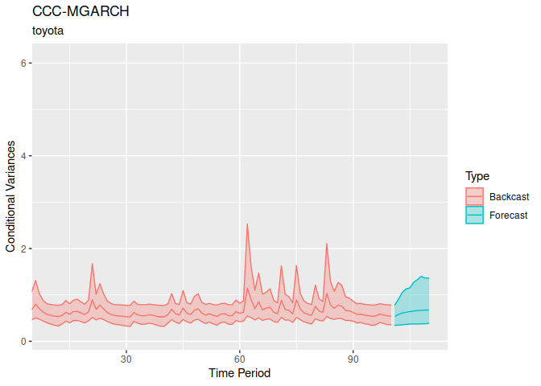

<!-- README.md is generated from README.Rmd. Please edit that file -->
<!-- knit with rmarkdown::render("README.Rmd", output_format = "md_document") -->
<!-- badges: start -->

\[\]
<!-- badges: end -->

bmgarch
=======

`bmgarch` estimates Bayesian multivariate generalized autoregressive
conditional heteroskedasticity (MGARCH) models. Currently, bmgarch
supports ARMA(1,1) and intercept-only (Constant) mean structures, and a
variety of MGARCH(P,Q) parameterizations. In increasing order of
complexity:

-   CCC(P, Q): Constant Conditional Correlation
-   DCC(P, Q): Dynamic Conditional Correlation
-   BEKK(P, Q): Baba, Engle, Kraft, and Kroner
-   pdBEKK(P, Q): BEKK(P, Q) with positive diagonal constraints

Installation
------------

`bmgarch` is not yet available on CRAN.

The development version can be installed from
[GitHub](https://github.com/) with:

    devtools::install_github("ph-rast/bmgarch")

Example 1: Behavioral Data
--------------------------

In this example, we use the pdBEKK(1,1) model for the variances, and an
intercept-only model for the means.

    library(bmgarch)

    data(panas)
    head(panas)
    #>      Pos    Neg
    #> 1 -2.193 -2.419
    #> 2  1.567 -0.360
    #> 3 -0.124 -1.202
    #> 4  0.020 -1.311
    #> 5 -0.150  2.004
    #> 6  3.877  1.008

    # Fit pdBEKK(1, 1) with ARMA(1,1) on the mean structure.
    fit <- bmgarch(panas,
                   parameterization = "pdBEKK",
                   iterations = 1000,
                   P = 1, Q = 1,
                   distribution = "Student_t",
                   meanstructure = "arma")
    #> 
    #> CHECKING DATA AND PREPROCESSING FOR MODEL 'pdBEKKMGARCH' NOW.
    #> 
    #> COMPILING MODEL 'pdBEKKMGARCH' NOW.
    #> 
    #> STARTING SAMPLER FOR MODEL 'pdBEKKMGARCH' NOW.

### Parameter estimates

    summary(fit)
    #> Model: pdBEKK-MGARCH
    #> Basic Specification: H_t = D_t R D_t
    #> H_t = C + A'[y_(t-1)*y'_(t-1)]A + B'H_(t-1)B
    #> 
    #> Distribution:  Student_t
    #> ---
    #> Iterations:  1000
    #> Chains:  4
    #> Date:  Mon Aug 31 15:55:31 2020
    #> Elapsed time (min):  12.08
    #> 
    #> ---
    #> Constant correlation, R (diag[C]*R*diag[C]):
    #> 
    #>         mean   sd  mdn  2.5% 97.5%   n_eff Rhat
    #> R_Ng-Ps 0.02 0.49 0.02 -0.92  0.93 1271.22    1
    #> 
    #> 
    #> Constant variances (diag[C]):
    #> 
    #>        mean   sd  mdn 2.5% 97.5%  n_eff Rhat
    #> var_Ps 0.70 0.89 0.32 0.01  3.21 273.81 1.01
    #> var_Ng 1.21 0.44 1.26 0.18  1.93 346.41 1.01
    #> 
    #> 
    #> MGARCH(1,1) estimates for A:
    #> 
    #>         mean   sd  mdn  2.5% 97.5%   n_eff Rhat
    #> A_Ps-Ps 0.34 0.10 0.34  0.15  0.54 1447.48    1
    #> A_Ng-Ps 0.06 0.08 0.06 -0.09  0.21 1733.92    1
    #> A_Ps-Ng 0.05 0.15 0.05 -0.27  0.35 1328.46    1
    #> A_Ng-Ng 0.39 0.12 0.40  0.14  0.63 1295.68    1
    #> 
    #> 
    #> MGARCH(1,1) estimates for B:
    #> 
    #>          mean   sd   mdn  2.5% 97.5%  n_eff Rhat
    #> B_Ps-Ps  0.73 0.24  0.83  0.08  0.94 271.16 1.01
    #> B_Ng-Ps -0.08 0.18 -0.09 -0.48  0.45 265.64 1.01
    #> B_Ps-Ng  0.28 0.38  0.27 -0.67  1.11 416.28 1.01
    #> B_Ng-Ng  0.35 0.21  0.34  0.03  0.78 759.18 1.01
    #> 
    #> 
    #> ARMA(1,1) estimates on the location:
    #> 
    #>                  mean   sd   mdn  2.5% 97.5%   n_eff Rhat
    #> (Intercept)_Pos -0.02 0.16 -0.01 -0.35  0.31 1136.93 1.00
    #> (Intercept)_Neg  0.07 0.13  0.06 -0.17  0.34 1072.79 1.00
    #> Phi_Pos-Pos     -0.03 0.36 -0.02 -0.77  0.67  871.57 1.00
    #> Phi_Pos-Neg     -0.12 0.47 -0.12 -0.91  0.76  647.82 1.00
    #> Phi_Neg-Pos     -0.14 0.33 -0.15 -0.77  0.55  673.81 1.00
    #> Phi_Neg-Neg      0.04 0.45  0.04 -0.80  0.84  409.75 1.01
    #> Theta_Pos-Pos   -0.06 0.38 -0.07 -0.79  0.71  834.22 1.00
    #> Theta_Pos-Neg    0.02 0.47  0.05 -0.87  0.82  673.04 1.00
    #> Theta_Neg-Pos    0.16 0.33  0.18 -0.53  0.80  688.72 1.00
    #> Theta_Neg-Neg   -0.05 0.46 -0.05 -0.90  0.80  389.00 1.01
    #> 
    #> 
    #> Df constant student_t (nu):
    #> 
    #>    mean      sd     mdn    2.5%   97.5%   n_eff    Rhat 
    #>   53.46   28.47   48.79   14.81  122.21 2107.95    1.00 
    #> 
    #> 
    #> Log density posterior estimate:
    #> 
    #>    mean      sd     mdn    2.5%   97.5%   n_eff    Rhat 
    #> -802.89    5.08 -802.35 -813.83 -794.33  242.46    1.02

### Forecasted values

    fit.fc <- forecast(fit, ahead = 5)

    fit.fc
    #> ---
    #> [Mean] Forecast for 5 ahead:
    #> 
    #> Pos :
    #>       
    #> period  mean   sd   mdn  2.5% 97.5%   n_eff Rhat
    #>    201 -0.36 2.96 -0.40 -6.28  5.44 1981.88    1
    #>    202 -0.20 2.79 -0.24 -5.44  5.41 1990.97    1
    #>    203 -0.10 2.69 -0.12 -5.48  5.03 1953.46    1
    #>    204 -0.12 2.65 -0.15 -5.40  4.85 1800.47    1
    #>    205 -0.01 2.59  0.01 -5.21  5.12 2000.92    1
    #> Neg :
    #>       
    #> period mean   sd  mdn  2.5% 97.5%   n_eff Rhat
    #>    201 0.38 1.50 0.40 -2.49  3.27 1679.38    1
    #>    202 0.21 1.60 0.21 -2.95  3.34 1972.70    1
    #>    203 0.20 1.58 0.22 -3.03  3.16 1908.89    1
    #>    204 0.18 1.54 0.21 -2.86  3.25 1952.91    1
    #>    205 0.12 1.58 0.09 -2.87  3.26 2000.27    1
    #> ---
    #> [Variance] Forecast for 5 ahead:
    #> 
    #> Pos :
    #>       
    #> period mean   sd  mdn 2.5% 97.5%   n_eff Rhat
    #>    201 7.87 2.53 7.69 3.94 13.35  593.13    1
    #>    202 7.28 3.39 6.74 3.45 14.92  905.31    1
    #>    203 6.83 3.59 6.02 3.25 15.54 1265.66    1
    #>    204 6.52 3.94 5.43 2.97 16.41 1710.85    1
    #>    205 6.31 4.09 5.07 2.84 17.48 1748.84    1
    #> Neg :
    #>       
    #> period mean   sd  mdn 2.5% 97.5%   n_eff Rhat
    #>    201 1.96 0.41 1.90 1.35  2.95 1312.02    1
    #>    202 2.25 0.88 2.05 1.37  4.29 1581.62    1
    #>    203 2.33 1.16 2.06 1.40  4.77 1930.01    1
    #>    204 2.32 1.38 2.05 1.40  4.76 1659.10    1
    #>    205 2.32 1.50 2.05 1.38  4.92 1529.97    1
    #> [Correlation] Forecast for 5 ahead:
    #> 
    #> Neg_Pos :
    #>       
    #> period  mean   sd   mdn  2.5% 97.5%   n_eff Rhat
    #>    201 -0.07 0.17 -0.07 -0.41  0.23  860.80    1
    #>    202 -0.07 0.21 -0.07 -0.47  0.39 1008.41    1
    #>    203 -0.06 0.21 -0.06 -0.47  0.40  927.80    1
    #>    204 -0.05 0.20 -0.05 -0.46  0.39 1427.12    1
    #>    205 -0.03 0.20 -0.03 -0.42  0.41 1690.83    1

    plot(fit.fc, askNewPage = FALSE, type = "var")

    plot(fit.fc, askNewPage = FALSE, type = "cor")

Example 2: Stocks
-----------------

Here we use the first 100 days of Stata's stocks data on daily lagged
returns of three Japanese automakers, Toyota, Nissan, and Honda.

    library(bmgarch)

    data(stocks)
    head(stocks)
    #>         date t       toyota       nissan        honda
    #> 1 2003-01-02 1  0.015167475  0.029470444  0.031610250
    #> 2 2003-01-03 2  0.004820108  0.008173466  0.002679110
    #> 3 2003-01-06 3  0.019958735  0.013064146 -0.001606464
    #> 4 2003-01-07 4 -0.013322592 -0.007444382 -0.011317968
    #> 5 2003-01-08 5 -0.027001143 -0.018856525 -0.016944885
    #> 6 2003-01-09 6  0.011634588  0.016986847  0.013687611

Ease computation by first standardizing the time series

    stocks.z <- scale(stocks[,c("toyota", "nissan", "honda")])
    head(stocks.z )
    #>       toyota     nissan       honda
    #> 1  0.8151655  1.3417896  1.52836901
    #> 2  0.2517820  0.3687089  0.11213515
    #> 3  1.0760354  0.5921691 -0.09765177
    #> 4 -0.7360344 -0.3448866 -0.57304819
    #> 5 -1.4807910 -0.8663191 -0.84849638
    #> 6  0.6228102  0.7714013  0.65102202

    # Fit CCC(1, 1) with constant on the mean structure.
    fit1 <- bmgarch(stocks.z[1:100, c("toyota", "nissan", "honda")],
                    parameterization = "CCC",
                    iterations = 100,
                    P = 1, Q = 1,
                    distribution = "Student_t",
                    meanstructure = "constant")
    #> 
    #> CHECKING DATA AND PREPROCESSING FOR MODEL 'CCCMGARCH' NOW.
    #> 
    #> COMPILING MODEL 'CCCMGARCH' NOW.
    #> 
    #> STARTING SAMPLER FOR MODEL 'CCCMGARCH' NOW.

### Parameter Estimates

    summary( fit1 )
    #> Model: CCC-MGARCH
    #> Basic Specification: H_t = D_t R D_t
    #>  diag(D_t) = sqrt(h_[ii,t]) = c_h + a_h*y^2_[t-1] + b_h*h_[ii, t-1
    #> 
    #> Distribution:  Student_t
    #> ---
    #> Iterations:  100
    #> Chains:  4
    #> Date:  Mon Aug 31 15:56:06 2020
    #> Elapsed time (min):  0.31
    #> 
    #> GARCH(1,1)  estimates for conditional variance:
    #> 
    #>            mean   sd  mdn 2.5% 97.5%  n_eff Rhat
    #> a_h_1,ty   0.09 0.08 0.08 0.00  0.30 350.87 0.98
    #> a_h_1,ns   0.08 0.07 0.06 0.01  0.24 434.39 1.00
    #> a_h_1,hn   0.10 0.07 0.08 0.01  0.30 312.91 0.98
    #> b_h_1,ty   0.45 0.19 0.47 0.11  0.75 326.16 0.98
    #> b_h_1,ns   0.39 0.18 0.38 0.08  0.71 253.79 0.99
    #> b_h_1,hn   0.41 0.20 0.42 0.09  0.79 460.21 1.00
    #> c_h_var_ty 0.29 0.14 0.27 0.10  0.60 282.89 0.99
    #> c_h_var_ns 0.36 0.13 0.35 0.13  0.61 260.51 0.99
    #> c_h_var_hn 0.44 0.18 0.42 0.15  0.80 460.21 0.99
    #> 
    #> 
    #> Constant correlation (R) coefficients:
    #> 
    #>         mean   sd  mdn 2.5% 97.5%  n_eff Rhat
    #> R_ns-ty 0.65 0.07 0.66 0.52  0.76 222.76 0.99
    #> R_hn-ty 0.73 0.05 0.74 0.62  0.82 241.75 1.00
    #> R_hn-ns 0.65 0.07 0.65 0.52  0.77 240.58 1.01
    #> 
    #> 
    #> Intercept estimates on the location:
    #> 
    #>                     mean   sd   mdn  2.5% 97.5%  n_eff Rhat
    #> (Intercept)_toyota -0.09 0.08 -0.09 -0.23  0.06 192.52 0.99
    #> (Intercept)_nissan  0.01 0.09  0.01 -0.17  0.16 184.45 1.01
    #> (Intercept)_honda  -0.02 0.09 -0.02 -0.19  0.14 246.46 0.99
    #> 
    #> 
    #> Df constant student_t (nu):
    #> 
    #>   mean     sd    mdn   2.5%  97.5%  n_eff   Rhat 
    #>  33.12  24.70  24.97   7.69  90.08 191.42   0.99 
    #> 
    #> 
    #> Log density posterior estimate:
    #> 
    #>    mean      sd     mdn    2.5%   97.5%   n_eff    Rhat 
    #> -178.38    5.14 -177.77 -189.49 -170.28   63.13    1.06

### Forecasted Values

Forecast volatility 10 days ahead

    fc <- forecast(fit1, ahead = 10 )
    fc
    #> ---
    #> [Variance] Forecast for 10 ahead:
    #> 
    #> toyota :
    #>       
    #> period mean   sd  mdn 2.5% 97.5%  n_eff Rhat
    #>    101 0.54 0.13 0.53 0.33  0.83 255.87 1.00
    #>    102 0.58 0.15 0.55 0.33  0.92 247.08 1.00
    #>    103 0.59 0.17 0.56 0.32  0.99 265.83 1.00
    #>    104 0.62 0.19 0.58 0.34  1.07 216.73 1.00
    #>    105 0.64 0.20 0.59 0.34  1.13 185.42 1.00
    #>    106 0.65 0.25 0.61 0.37  1.20 177.90 1.00
    #>    107 0.66 0.27 0.62 0.35  1.19 181.30 1.00
    #>    108 0.67 0.26 0.61 0.39  1.43 186.23 1.00
    #>    109 0.66 0.34 0.60 0.37  1.28 196.14 1.00
    #>    110 0.66 0.24 0.61 0.35  1.28 204.17 0.99
    #> nissan :
    #>       
    #> period mean   sd  mdn 2.5% 97.5%  n_eff Rhat
    #>    101 0.63 0.12 0.62 0.44  0.86 205.81    1
    #>    102 0.65 0.15 0.63 0.44  0.95 199.69    1
    #>    103 0.67 0.20 0.64 0.45  1.08 200.51    1
    #>    104 0.69 0.21 0.64 0.45  1.23 217.70    1
    #>    105 0.68 0.24 0.64 0.45  1.14 229.15    1
    #>    106 0.70 0.23 0.65 0.44  1.29 197.44    1
    #>    107 0.70 0.20 0.65 0.43  1.11 196.33    1
    #>    108 0.71 0.28 0.65 0.42  1.45 173.90    1
    #>    109 0.69 0.23 0.64 0.43  1.21 175.49    1
    #>    110 0.70 0.27 0.63 0.44  1.27 185.52    1
    #> honda :
    #>       
    #> period mean   sd  mdn 2.5% 97.5%  n_eff Rhat
    #>    101 0.78 0.16 0.77 0.49  1.11 188.60 1.01
    #>    102 0.83 0.19 0.80 0.48  1.26 195.55 1.01
    #>    103 0.88 0.29 0.83 0.51  1.73 204.49 1.00
    #>    104 0.93 0.44 0.83 0.54  1.81 212.01 1.00
    #>    105 0.95 0.54 0.83 0.51  2.06 173.92 1.00
    #>    106 0.94 0.36 0.86 0.55  1.80 163.24 1.00
    #>    107 0.91 0.31 0.83 0.54  1.59 155.55 1.01
    #>    108 0.93 0.32 0.85 0.52  1.86 168.75 1.00
    #>    109 0.94 0.43 0.85 0.49  1.79 106.17 1.01
    #>    110 0.95 0.45 0.85 0.51  1.75 146.40 1.00

    plot(fc,askNewPage = FALSE, type = 'var' )

Add two additional models, one with CCC(2,2) and a DCC(1,1)

    # Fit CCC(1, 1) with constant on the mean structure.
    fit2 <- bmgarch(stocks.z[1:100, c("toyota", "nissan", "honda")],
                    parameterization = "CCC",
                    iterations = 100,
                    P = 2, Q = 2,
                    distribution = "Student_t",
                    meanstructure = "constant")
    #> 
    #> CHECKING DATA AND PREPROCESSING FOR MODEL 'CCCMGARCH' NOW.
    #> 
    #> COMPILING MODEL 'CCCMGARCH' NOW.
    #> 
    #> STARTING SAMPLER FOR MODEL 'CCCMGARCH' NOW.

    fit3 <- bmgarch(stocks.z[1:100, c("toyota", "nissan", "honda")],
                    parameterization = "DCC",
                    iterations = 100,
                    P = 1, Q = 1,
                    distribution = "Student_t",
                    meanstructure = "arma")
    #> 
    #> CHECKING DATA AND PREPROCESSING FOR MODEL 'DCCMGARCH' NOW.
    #> 
    #> COMPILING MODEL 'DCCMGARCH' NOW.
    #> 
    #> STARTING SAMPLER FOR MODEL 'DCCMGARCH' NOW.

The DCC(1,1) model also incorporates an ARMA(1,1) meanstructure. The
output will have the according information:

    summary( fit3 )
    #> Model: DCC-MGARCH
    #> Basic Specification: H_t = D_t R D_t
    #>  diag(D_t) = sqrt(h_ii,t) = c_h + a_h*y^2_[t-1] + b_h*h_[ii,t-1]
    #>  R_t = Q^[-1]_t Q_t Q^[-1]_t = ( 1 - a_q - b_q)S + a_q(u_[t-1]u'_[t-1]) + b_q(Q_[t-1])
    #> 
    #> Distribution:  Student_t
    #> ---
    #> Iterations:  100
    #> Chains:  4
    #> Date:  Mon Aug 31 15:58:40 2020
    #> Elapsed time (min):  1.67
    #> 
    #> GARCH(1,1)  estimates for conditional variance on D:
    #> 
    #>            mean   sd  mdn 2.5% 97.5%  n_eff Rhat
    #> a_h_1,ty   0.15 0.12 0.13 0.01  0.49 198.52 0.99
    #> a_h_1,ns   0.10 0.09 0.08 0.01  0.31 124.50 1.04
    #> a_h_1,hn   0.13 0.09 0.12 0.01  0.34 202.12 1.00
    #> b_h_1,ty   0.44 0.16 0.44 0.13  0.73 142.13 1.00
    #> b_h_1,ns   0.43 0.21 0.43 0.06  0.83 116.07 1.04
    #> b_h_1,hn   0.45 0.19 0.46 0.06  0.79 112.35 1.00
    #> c_h_var_ty 0.28 0.11 0.26 0.12  0.50 102.68 1.02
    #> c_h_var_ns 0.31 0.14 0.31 0.08  0.59 125.56 1.02
    #> c_h_var_hn 0.38 0.16 0.38 0.13  0.71 158.45 1.00
    #> 
    #> 
    #> GARCH(1,1) estimates for conditional variance on Q:
    #> 
    #>     mean   sd  mdn 2.5% 97.5%  n_eff Rhat
    #> a_q 0.21 0.10 0.20 0.05  0.45 103.03 1.04
    #> b_q 0.22 0.14 0.22 0.00  0.50 177.47 1.00
    #> 
    #> 
    #> Unconditional correlation 'S' in Q:
    #> 
    #>         mean   sd  mdn 2.5% 97.5%  n_eff Rhat
    #> S_ns-ty 0.60 0.08 0.60 0.41  0.75 162.92 1.02
    #> S_hn-ty 0.72 0.07 0.74 0.59  0.83 244.05 0.99
    #> S_hn-ns 0.62 0.08 0.63 0.44  0.75 194.86 1.00
    #> 
    #> 
    #> ARMA(1,1) estimates on the location:
    #> 
    #>                      mean   sd   mdn  2.5% 97.5%  n_eff Rhat
    #> (Intercept)_toyota  -0.07 0.09 -0.07 -0.23  0.13 171.45 1.03
    #> (Intercept)_nissan   0.02 0.09  0.01 -0.14  0.19 179.83 1.00
    #> (Intercept)_honda   -0.01 0.13  0.00 -0.24  0.28 175.79 0.99
    #> Phi_toyota-toyota    0.05 0.33  0.08 -0.58  0.56  82.34 1.04
    #> Phi_toyota-nissan    0.01 0.39  0.05 -0.77  0.72  90.75 1.05
    #> Phi_toyota-honda     0.17 0.35  0.17 -0.50  0.82 120.01 1.00
    #> Phi_nissan-toyota    0.29 0.39  0.36 -0.50  0.91 118.88 0.99
    #> Phi_nissan-nissan   -0.15 0.36 -0.23 -0.73  0.73  90.65 1.06
    #> Phi_nissan-honda     0.20 0.35  0.19 -0.43  0.88  77.06 1.05
    #> Phi_honda-toyota    -0.23 0.38 -0.25 -0.85  0.48  99.63 1.02
    #> Phi_honda-nissan     0.13 0.38  0.16 -0.63  0.81  61.08 1.07
    #> Phi_honda-honda     -0.13 0.29 -0.12 -0.69  0.47  79.87 1.03
    #> Theta_toyota-toyota -0.17 0.35 -0.21 -0.77  0.47  65.66 1.05
    #> Theta_toyota-nissan  0.16 0.38  0.12 -0.51  0.89  97.26 1.04
    #> Theta_toyota-honda  -0.14 0.34 -0.14 -0.78  0.53 113.93 1.02
    #> Theta_nissan-toyota -0.32 0.39 -0.35 -0.88  0.57 125.39 0.99
    #> Theta_nissan-nissan  0.18 0.33  0.22 -0.60  0.69  96.06 1.05
    #> Theta_nissan-honda  -0.23 0.36 -0.19 -0.89  0.46  89.66 1.04
    #> Theta_honda-toyota  -0.06 0.40 -0.01 -0.87  0.63  75.56 1.04
    #> Theta_honda-nissan   0.02 0.40 -0.02 -0.74  0.81  47.01 1.09
    #> Theta_honda-honda    0.25 0.33  0.24 -0.36  0.82  65.84 1.04
    #> 
    #> 
    #> Df constant student_t (nu):
    #> 
    #>   mean     sd    mdn   2.5%  97.5%  n_eff   Rhat 
    #>  45.07  26.55  37.22  12.88 118.37 460.21   0.98 
    #> 
    #> 
    #> Log density posterior estimate:
    #> 
    #>    mean      sd     mdn    2.5%   97.5%   n_eff    Rhat 
    #> -176.00    5.91 -175.56 -187.25 -166.31   82.26    1.02
    fc <- forecast(fit3, ahead =  10)

    plot( fc,askNewPage = FALSE, type =  'mean' ) 

### Ensemble Models

Obtain model weights with either the stacking or the pseudo BMA method.
These methods are inherited from the `loo` package.

    ## use bmgarch_list function to collect bmgarch objects
    modfits <- bmgarch_list(fit1, fit2, fit3)

### Compute Model Weights

Compute model weights with the stacking method and the the approximate
leave-future-out cross validation (LFO CV). `L` defines the minimal
length of the time series before we start engaging in cross-validation.
Note that the standard is to use the approximate `backward` method to CV
as it results in fewest refits. Exact CV is also available with `exact`
but not encouraged as it results in refitting all CV models.

    mw <- model_weights(modfits, L = 50, method = 'stacking' )
    #> 
    #> CHECKING DATA AND PREPROCESSING FOR MODEL 'CCCMGARCH' NOW.
    #> 
    #> COMPILING MODEL 'CCCMGARCH' NOW.
    #> 
    #> STARTING SAMPLER FOR MODEL 'CCCMGARCH' NOW.
    #> 
    #> CHECKING DATA AND PREPROCESSING FOR MODEL 'CCCMGARCH' NOW.
    #> 
    #> COMPILING MODEL 'CCCMGARCH' NOW.
    #> 
    #> STARTING SAMPLER FOR MODEL 'CCCMGARCH' NOW.
    #> 
    #> CHECKING DATA AND PREPROCESSING FOR MODEL 'CCCMGARCH' NOW.
    #> 
    #> COMPILING MODEL 'CCCMGARCH' NOW.
    #> 
    #> STARTING SAMPLER FOR MODEL 'CCCMGARCH' NOW.
    #> 
    #> CHECKING DATA AND PREPROCESSING FOR MODEL 'CCCMGARCH' NOW.
    #> 
    #> COMPILING MODEL 'CCCMGARCH' NOW.
    #> 
    #> STARTING SAMPLER FOR MODEL 'CCCMGARCH' NOW.
    #> Using threshold  0.6 , model was refit  4  times, at observations 84 73 61 55 
    #> 
    #> CHECKING DATA AND PREPROCESSING FOR MODEL 'CCCMGARCH' NOW.
    #> 
    #> COMPILING MODEL 'CCCMGARCH' NOW.
    #> 
    #> STARTING SAMPLER FOR MODEL 'CCCMGARCH' NOW.
    #> 
    #> CHECKING DATA AND PREPROCESSING FOR MODEL 'CCCMGARCH' NOW.
    #> 
    #> COMPILING MODEL 'CCCMGARCH' NOW.
    #> 
    #> STARTING SAMPLER FOR MODEL 'CCCMGARCH' NOW.
    #> 
    #> CHECKING DATA AND PREPROCESSING FOR MODEL 'CCCMGARCH' NOW.
    #> 
    #> COMPILING MODEL 'CCCMGARCH' NOW.
    #> 
    #> STARTING SAMPLER FOR MODEL 'CCCMGARCH' NOW.
    #> Using threshold  0.6 , model was refit  3  times, at observations 81 71 55 
    #> 
    #> CHECKING DATA AND PREPROCESSING FOR MODEL 'DCCMGARCH' NOW.
    #> 
    #> COMPILING MODEL 'DCCMGARCH' NOW.
    #> 
    #> STARTING SAMPLER FOR MODEL 'DCCMGARCH' NOW.
    #> 
    #> CHECKING DATA AND PREPROCESSING FOR MODEL 'DCCMGARCH' NOW.
    #> 
    #> COMPILING MODEL 'DCCMGARCH' NOW.
    #> 
    #> STARTING SAMPLER FOR MODEL 'DCCMGARCH' NOW.
    #> 
    #> CHECKING DATA AND PREPROCESSING FOR MODEL 'DCCMGARCH' NOW.
    #> 
    #> COMPILING MODEL 'DCCMGARCH' NOW.
    #> 
    #> STARTING SAMPLER FOR MODEL 'DCCMGARCH' NOW.
    #> 
    #> CHECKING DATA AND PREPROCESSING FOR MODEL 'DCCMGARCH' NOW.
    #> 
    #> COMPILING MODEL 'DCCMGARCH' NOW.
    #> 
    #> STARTING SAMPLER FOR MODEL 'DCCMGARCH' NOW.
    #> 
    #> CHECKING DATA AND PREPROCESSING FOR MODEL 'DCCMGARCH' NOW.
    #> 
    #> COMPILING MODEL 'DCCMGARCH' NOW.
    #> 
    #> STARTING SAMPLER FOR MODEL 'DCCMGARCH' NOW.
    #> 
    #> CHECKING DATA AND PREPROCESSING FOR MODEL 'DCCMGARCH' NOW.
    #> 
    #> COMPILING MODEL 'DCCMGARCH' NOW.
    #> 
    #> STARTING SAMPLER FOR MODEL 'DCCMGARCH' NOW.
    #> 
    #> CHECKING DATA AND PREPROCESSING FOR MODEL 'DCCMGARCH' NOW.
    #> 
    #> COMPILING MODEL 'DCCMGARCH' NOW.
    #> 
    #> STARTING SAMPLER FOR MODEL 'DCCMGARCH' NOW.
    #> 
    #> CHECKING DATA AND PREPROCESSING FOR MODEL 'DCCMGARCH' NOW.
    #> 
    #> COMPILING MODEL 'DCCMGARCH' NOW.
    #> 
    #> STARTING SAMPLER FOR MODEL 'DCCMGARCH' NOW.
    #> 
    #> CHECKING DATA AND PREPROCESSING FOR MODEL 'DCCMGARCH' NOW.
    #> 
    #> COMPILING MODEL 'DCCMGARCH' NOW.
    #> 
    #> STARTING SAMPLER FOR MODEL 'DCCMGARCH' NOW.
    #> 
    #> CHECKING DATA AND PREPROCESSING FOR MODEL 'DCCMGARCH' NOW.
    #> 
    #> COMPILING MODEL 'DCCMGARCH' NOW.
    #> 
    #> STARTING SAMPLER FOR MODEL 'DCCMGARCH' NOW.
    #> 
    #> CHECKING DATA AND PREPROCESSING FOR MODEL 'DCCMGARCH' NOW.
    #> 
    #> COMPILING MODEL 'DCCMGARCH' NOW.
    #> 
    #> STARTING SAMPLER FOR MODEL 'DCCMGARCH' NOW.
    #> 
    #> CHECKING DATA AND PREPROCESSING FOR MODEL 'DCCMGARCH' NOW.
    #> 
    #> COMPILING MODEL 'DCCMGARCH' NOW.
    #> 
    #> STARTING SAMPLER FOR MODEL 'DCCMGARCH' NOW.
    #> Using threshold  0.6 , model was refit  12  times, at observations 96 90 85 84 74 71 64 60 58 53 51 50

    ## Return model weights:
    mw
    #> Method: stacking
    #> ------
    #>        weight
    #> model1 0.000 
    #> model2 1.000 
    #> model3 0.000

### Weighted Forecasting

Use model weights to obtain weighted forecasts. Here we will forecast 5
days ahead.

    w_fc <- forecast(modfits, ahead = 5, weights = mw )
    w_fc
    #> ---
    #> LFO-weighted forecasts across  3 models.
    #> ---
    #> [Mean] Forecast for 5 ahead:
    #> 
    #> toyota :
    #>       
    #> period  mean   sd   mdn  2.5% 97.5% n_eff Rhat
    #>    101  0.01 0.74  0.05 -1.55  1.28    NA   NA
    #>    102 -0.12 0.75 -0.18 -1.44  1.38    NA   NA
    #>    103 -0.08 0.83 -0.07 -1.44  1.51    NA   NA
    #>    104 -0.23 0.84 -0.29 -2.02  1.32    NA   NA
    #>    105 -0.09 0.78 -0.06 -1.60  1.41    NA   NA
    #> nissan :
    #>       
    #> period  mean   sd   mdn  2.5% 97.5% n_eff Rhat
    #>    101  0.01 0.82  0.05 -1.71  1.41    NA   NA
    #>    102 -0.08 0.82 -0.12 -1.72  1.54    NA   NA
    #>    103 -0.05 0.86  0.03 -1.74  1.38    NA   NA
    #>    104 -0.14 0.89 -0.24 -1.81  1.70    NA   NA
    #>    105 -0.06 0.78 -0.03 -1.59  1.48    NA   NA
    #> honda :
    #>       
    #> period  mean   sd   mdn  2.5% 97.5% n_eff Rhat
    #>    101  0.11 0.82  0.18 -1.48  1.58    NA   NA
    #>    102 -0.07 0.83 -0.06 -1.70  1.80    NA   NA
    #>    103  0.01 0.97 -0.06 -1.90  1.75    NA   NA
    #>    104 -0.14 1.00 -0.08 -2.36  2.00    NA   NA
    #>    105 -0.06 0.89 -0.13 -1.60  1.71    NA   NA
    #> ---
    #> [Variance] Forecast for 5 ahead:
    #> 
    #> toyota :
    #>       
    #> period mean   sd  mdn 2.5% 97.5% n_eff Rhat
    #>    101 0.54 0.11 0.53 0.32  0.78    NA   NA
    #>    102 0.56 0.12 0.54 0.34  0.81    NA   NA
    #>    103 0.59 0.19 0.58 0.37  0.89    NA   NA
    #>    104 0.62 0.18 0.60 0.36  1.07    NA   NA
    #>    105 0.64 0.20 0.61 0.38  1.14    NA   NA
    #> nissan :
    #>       
    #> period mean   sd  mdn 2.5% 97.5% n_eff Rhat
    #>    101 0.64 0.11 0.62 0.46  0.90    NA   NA
    #>    102 0.65 0.14 0.63 0.44  0.97    NA   NA
    #>    103 0.68 0.24 0.64 0.45  1.03    NA   NA
    #>    104 0.67 0.18 0.65 0.45  1.14    NA   NA
    #>    105 0.70 0.25 0.65 0.45  1.19    NA   NA
    #> honda :
    #>       
    #> period mean   sd  mdn 2.5% 97.5% n_eff Rhat
    #>    101 0.80 0.15 0.78 0.55  1.12    NA   NA
    #>    102 0.78 0.18 0.76 0.50  1.20    NA   NA
    #>    103 0.84 0.23 0.80 0.52  1.44    NA   NA
    #>    104 0.87 0.31 0.80 0.52  1.52    NA   NA
    #>    105 0.91 0.37 0.85 0.50  2.18    NA   NA
    #> [Correlation] Forecast for 5 ahead:
    #> 
    #> nissan_toyota :
    #>       
    #> period mean   sd  mdn 2.5% 97.5% n_eff Rhat
    #>    101 0.65 0.06 0.66 0.51  0.76    NA   NA
    #>    102 0.65 0.06 0.66 0.51  0.76    NA   NA
    #>    103 0.65 0.06 0.66 0.51  0.76    NA   NA
    #>    104 0.65 0.06 0.66 0.51  0.76    NA   NA
    #>    105 0.65 0.06 0.66 0.51  0.76    NA   NA
    #> honda_toyota :
    #>       
    #> period mean   sd  mdn 2.5% 97.5% n_eff Rhat
    #>    101 0.74 0.05 0.74 0.63  0.82    NA   NA
    #>    102 0.74 0.05 0.74 0.63  0.82    NA   NA
    #>    103 0.74 0.05 0.74 0.63  0.82    NA   NA
    #>    104 0.74 0.05 0.74 0.63  0.82    NA   NA
    #>    105 0.74 0.05 0.74 0.63  0.82    NA   NA
    #> honda_nissan :
    #>       
    #> period mean   sd  mdn 2.5% 97.5% n_eff Rhat
    #>    101 0.65 0.06 0.66 0.52  0.75    NA   NA
    #>    102 0.65 0.06 0.66 0.52  0.75    NA   NA
    #>    103 0.65 0.06 0.66 0.52  0.75    NA   NA
    #>    104 0.65 0.06 0.66 0.52  0.75    NA   NA
    #>    105 0.65 0.06 0.66 0.52  0.75    NA   NA

Plot the weighted forecast. Save plots into a ggplot object and
post-process

    plt <- plot(w_fc, askNewPage = FALSE, type =  'var' )

    library( patchwork )
    ( plt$honda  + ggplot2::coord_cartesian(ylim = c(0, 2.5 ) ) ) /
    ( plt$toyota + ggplot2::coord_cartesian(ylim = c(0, 2.5 ) ) ) /
    ( plt$nissan + ggplot2::coord_cartesian(ylim = c(0, 2.5 ) ) ) 
    #> Coordinate system already present. Adding new coordinate system, which will replace the existing one.
    #> Coordinate system already present. Adding new coordinate system, which will replace the existing one.
    #> Coordinate system already present. Adding new coordinate system, which will replace the existing one.

